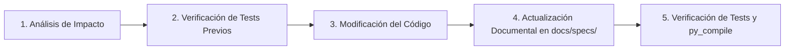

# Directivas y Protocolo de Gobernanza para Agentes de IA

Este documento establece las **normas contractuales e innegociables** que todo agente de IA (y desarrollador) debe seguir rigurosamente al operar, refactorizar o extender el código de **Study Timetrial**.

---

## 1. Principios Arquitectónicos Fundamentales

El proyecto sigue una arquitectura en capas limpia con patrón **MVP (Model-View-Presenter / Passive View)** para la capa de presentación:

```
[ Domain ]          <- Modelos, invariantes, lógica pura de cronómetro (Cero dependencias externas)
    ▲
[ Application ]     <- Casos de uso, orquestación, cálculo de estadísticas y planificación
    ▲
[ Presentation ]    <- Presenters (Python puro) + Vistas Pasivas (PySide6)
    │
[ Infrastructure ]   <- Persistencia JSON, adaptadores de audio, sistema de archivos
```

### Reglas Estrictas de Dependencias e Importaciones:
1. **Dominio (`domain/`)**: Está en el centro. **PROHIBIDO** importar nada de `application`, `presentation`, `infrastructure` o librerías de interfaz (`PySide6`, `Qt`).
2. **Aplicación (`application/`)**: Solo depende de `domain`. **PROHIBIDO** importar nada de `presentation` o `PySide6`.
3. **Presenters (`presentation/**/presenter.py`)**: Contienen la lógica de presentación y flujo de interacción. Están escritos en **Python puro**. **PROHIBIDO** importar clases o funciones de `PySide6` o `Qt`. Solo interactúan con las vistas mediante interfaces abstractas (`Protocol` o `ABC`).
4. **Vistas Pasivas (`presentation/**/view.py`, `subwidgets/`)**: Cascarones gráficos declarativos en `PySide6`. No implementan cálculos de tiempos ni reglas de negocio; solo emiten señales hacia el Presenter y reciben órdenes declarativas de visualización.
5. **Infraestructura (`infrastructure/`)**: Implementa la persistencia, acceso a disco y reproducción de audio.

---

## 2. Protocolo de Ciclo de Vida para Modificaciones de Código Existente

Ante cualquier solicitud de cambio, refactorización o corrección de bugs:



1. **Análisis de Impacto:** Localizar los módulos afectados y sus especificaciones correspondientes en `docs/specs/`.
2. **Verificación Previa:** Confirmar que los tests asociados pasen antes de introducir cambios.
3. **Modificación Limpia:** Respetar los contratos de capa y tipado estricto (`from __future__ import annotations`, tipos `typing`).
4. **Sincronización Documental Obligatoria:** Si se altera el comportamiento, parámetros o contratos de un componente, **es obligatorio actualizar su archivo de especificación en `docs/specs/` en la misma tarea**. Ningún cambio de código se considerará completado sin su documentación sincronizada.
5. **Verificación de No Regresión:**
   ```powershell
   python -m unittest discover -s tests -v
   python -m py_compile <archivos_modificados>
   ```

---

## 3. Protocolo Obligatorio para la Creación de Nuevos Apartados o Módulos

Cuando se requiera agregar una **nueva sección, pantalla o capacidad funcional** (por ejemplo: importación de archivos externos, exportación de reportes, módulo de configuración avanzada, sincronización):

El agente debe planificar y ejecutar la implementación siguiendo estrictamente este algoritmo de **7 fases**:

### Fase 1: Especificación Previa (`docs/specs/<nuevo_apartado>/`)
Antes de crear código fuente, el agente debe redactar la especificación técnica funcional:
* Crear `docs/specs/<nuevo_apartado>/<nombre>.spec.md`.
* Definir:
  1. Propósito funcional del módulo.
  2. Contratos de entrada/salida (formatos de datos, schemas JSON, DTOs).
  3. Comportamiento esperado ante errores o datos corruptos.
  4. Lista de eventos de usuario e interacciones soportadas.

### Fase 2: Modelado en Dominio y Casos de Uso en Aplicación
* En `domain/`: Crear las entidades puras o Value Objects inmutables con `@dataclass(frozen=True)`.
* En `application/`: Crear el servicio o caso de uso (`<Nuevo>Service`) con la lógica de negocio y las interfaces abstractas (puertos) para las dependencias externas.
* **Invariante:** Cero referencias a frameworks visuales.

### Fase 3: Adaptadores de Infraestructura (si aplica)
* Si el módulo realiza I/O (lectura de archivos, base de datos, hardware):
  * Implementar el adaptador en `infrastructure/<nuevo_apartado>/`.
  * Gestionar atomicidad en disco y manejo seguro de excepciones sin colapsar la app.

### Fase 4: Contrato de Vista y Presenter
* En `presentation/<nuevo_apartado>/interfaces.py`:
  * Definir `I<Nuevo>View(Protocol)` con métodos declarativos (ej: `show_items(...)`, `display_error(...)`, `set_loading(bool)`).
* En `presentation/<nuevo_apartado>/<nuevo>_presenter.py`:
  * Implementar el Presenter en **Python puro**.
  * Recibir `I<Nuevo>View` y los servicios de aplicación en `__init__`.
  * Manejar la lógica de los eventos generados por la vista.

### Fase 5: Vista Pasiva (PySide6)
* En `presentation/<nuevo_apartado>/<nuevo>_view.py`:
  * Implementar la clase de widget heredando de `QWidget` (o `QDialog`) y del protocolo `I<Nuevo>View`.
  * Construir los layouts utilizando los tokens de color del motor de temas (`get_theme_tokens()`).
  * Conectar señales de botones/entradas exclusivamente a métodos del Presenter.

### Fase 6: Batería de Pruebas Automatizadas
* Crear `tests/test_<nuevo_apartado>.py`:
  * Pruebas unitarias del Presenter utilizando un `Mock<Nuevo>View` (ejecución ultra-rápida en memoria).
  * Pruebas del servicio de aplicación y adaptadores de infraestructura.
  * Pruebas de integración visual básica con PySide6 en modo `offscreen`.

### Fase 7: Integración y Registro Maestro
* Registrar la nueva vista en `presentation/main_window.py` o en la barra de herramientas `presentation/app_toolbar.py`.
* Actualizar el índice maestro `docs/specs/README.md` y la documentación general del proyecto.

---

## 4. Checklist de Validación Final para el Agente

Antes de dar por finalizada cualquier intervención, el agente debe verificar:
- [ ] No existen imports de `PySide6`/`Qt` en `domain`, `application`, `infrastructure` (excepto audio/GUI nativo) ni en `*presenter.py`.
- [ ] La documentación en `docs/specs/` refleja con precisión el estado actual del código modificado.
- [ ] La suite de pruebas pasa sin errores: `python -m unittest discover -s tests -v`.
- [ ] Todos los archivos Python compilan limpiamente: `python -m py_compile ...`.
