# Product Backlog y Hoja de Ruta — Study Timetrial

**Fecha de creación:** 2026-09-13  
**Última actualización:** 2026-09-23  
**Estado general:** En desarrollo activo  
**Audiencia / Destino:** Desarrolladores humanos y Agentes Autónomos de IA  

> **Guía operativa para Agentes de IA:** Este documento constituye la fuente única de verdad para la planificación y ejecución de tareas. Está estructurado rigurosamente por **Sectores Funcionales** y **Árboles de Correlatividad / Dependencias**. Cada ítem incluye contexto funcional, puntos de contacto arquitectónicos por archivo y criterios de aceptación verificables mediante tests automatizados.

---

## 1. Convenciones y Estructura

### Tipos de Tarea (Standard Issue Types)
- ✨ **Feature:** Nueva funcionalidad o módulo para el usuario.
- 🐛 **Bugfix:** Corrección de defectos, estados inválidos o fallos en tiempo de ejecución.
- 🔨 **Enhancement:** Evolución, rediseño o ampliación de una característica existente.
- ⚡ **Performance:** Optimización de algoritmos, estructuras de datos o fluidez gráfica.
- 🧹 **Refactor / Tech Debt:** Mejoras estructurales internas sin alteración del comportamiento externo.
- 🛡️ **Seguridad:** Protección de datos, respaldos preventivos y mitigación de fallos de persistencia.

### Estados de Tarea (Workflow Lifecycle)
- `[ ]` **Pendiente (Ready):** Tarea especificada técnicamente y lista para ser tomada por un agente o desarrollador.
- `[?]` **En revisión (In Review):** Tarea en etapa de análisis, diseño conceptual preliminar o validación de requisitos.
- `[/]` **En progreso (In Progress):** Tarea actualmente en desarrollo activo en el workspace.
- `[x]` **Completado (Done):** Código implementado, verificado manualmente y con el 100% de tests unitarios pasando.
- `[-]` **Descartado / Pospuesto (Archived):** Tarea cancelada o postergada formalmente con justificación documentada.

### Estados de Correlatividad y Dependencias (Dependency Lifecycle)
- 🏁 **Completada:** La tarea ya fue implementada, probada y sincronizada documentalmente.
- 🔓 **Desbloqueada / Lista para tomar:** Todos sus prerrequisitos técnicos están completados al 100% (o no posee dependencias). Puede iniciarse inmediatamente sin riesgo de bloqueo arquitectónico.
- 🔒 **Bloqueada / Condicionada:** Depende de una o más tareas previas que aún no han sido finalizadas. No debe iniciarse hasta que sus prerrequisitos alcancen el estado `[x]`.

### Niveles de Prioridad
- 🔴 **Alta:** Crítica para la estabilidad, el flujo principal de estudio o la arquitectura base.
- 🟡 **Media:** Mejora relevante de usabilidad, herramientas complementarias o ampliación funcional.
- 🟢 **Baja:** Ajuste cosmético menor, micro-optimización o exploración futura.

### Sectores Funcionales del Sistema (Functional Domains)
1. **Sector 1: Cronómetro, Temporizador y Dinámicas de Sesión (`core/` / `presentation/home/`):** Reloj de precisión (`TimerService`), modos (`PLAY`, `BREAK`, `WAITING`), modalidades de estudio (Libre, Pomodoro, Intensiva) y KPIs de jornada.
2. **Sector 2: Planificación, Metas y Contenido Curricular (`domain/` / `presentation/planner/`):** Estructura jerárquica de guías, ejercicios, incisos, etiquetas/marcadores de color y notas por ejercicio.
3. **Sector 3: Registros, Historial y Corrección de Datos (`application/` / `presentation/records/`):** Visualización masiva, filtros estilo Excel, edición en caliente, resolución de incisos y recarga al cronómetro.
4. **Sector 4: Estadísticas, Análisis y Reportes (`application/` / `presentation/statistics/`):** KPIs globales, ranking de tiempos, calendario de hitos de examen, distribución horaria 24h y exportación CSV/Excel.
5. **Sector 5: Audio, Efectos Sonoros y Ambientación (`infrastructure/audio/` / `presentation/ambience/`):** Mezclador multicanal adaptativo al cronómetro y reproductor de efectos acústicos discretos (*eyes-free feedback*).
6. **Sector 6: Infraestructura, Respaldo y Compatibilidad (`infrastructure/` / `infrastructure/compatibility/`):** Persistencia atómica de archivos JSON, snapshots preventivos y migración determinista de versiones de esquema.
7. **Sector 7: Experiencia de Escritorio, Preferencias y UI/UX (`presentation/theming/` / `presentation/`):** Motor de temas, atajos globales de teclado, accesibilidad y preferencias persistentes (`QSettings`).

### Reglas de Invarianza para Agentes de IA (AI Guardrails)
1. **Invarianza del contrato JSON:** Respetar la tolerancia a campos opcionales (`docs/CONTRATO_JSON.md`). Nunca renombrar ni eliminar campos del esquema `1` sin migración explícita; los nuevos campos deben tener valores predeterminados seguros (`None`, `[]`, `{}`).
2. **Separación de Capas (SoC):** La capa `presentation` nunca accede directamente a `infrastructure` ni muta `domain` directamente; toda interacción debe pasar por `StudyApplicationService`.
3. **Determinismo del temporizador:** No alterar `time.perf_counter()` en `TimerService` con llamadas bloqueantes en el hilo principal de la UI.
4. **Verificación automatizada obligatoria:** Toda tarea que modifique `domain`, `application` o `infrastructure` debe incluir o actualizar pruebas en `tests/`. El comando de validación obligatorio que debe pasar al 100% es:  
   `python -m unittest discover -s tests -v`

---

## 2. Matriz de Seguimiento y Árbol de Correlatividades

### 2.1 Mapa Visual de Correlatividades y Dependencias

```mermaid
flowchart TD
    classDef done fill:#16a34a,stroke:#15803d,color:#ffffff,stroke-width:2px;
    classDef ready fill:#2563eb,stroke:#1d4ed8,color:#ffffff,stroke-width:2px;
    classDef blocked fill:#64748b,stroke:#475569,color:#ffffff,stroke-dasharray: 4 4;
    classDef review fill:#d97706,stroke:#b45309,color:#ffffff,stroke-width:2px;

    subgraph SEC1["Sector 1: Cronómetro & Dinámicas de Sesión"]
        T005["TASK-005<br/>Estado sin proyecto"]:::done
        T014["TASK-014<br/>Rediseño Cronómetro & KPIs"]:::done
        T010["TASK-010<br/>Modo Pomodoro"]:::review
        T015["TASK-015<br/>Sesión Intensiva"]:::review
        T005 --> T014
        T014 --> T010
        T014 --> T015
    end

    subgraph SEC2["Sector 2: Planificación Curricular"]
        T002["TASK-002<br/>Marcadores & Tags"]:::done
        T003["TASK-003<br/>Notas por Ejercicio"]:::done
        T002 --> T003
    end

    subgraph SEC3["Sector 3: Registros & Historial"]
        T001["TASK-001<br/>Continuación en Cronómetro"]:::done
        T007["TASK-007<br/>Diálogo incisos en conflicto"]:::done
        T008["TASK-008<br/>Optimización de Registros"]:::done
    end

    subgraph SEC4["Sector 4: Estadísticas & Reportes"]
        T006["TASK-006<br/>Exámenes & KPIs 24h"]:::done
        T009["TASK-009<br/>Exportación CSV / Excel"]:::ready
        T011["TASK-011<br/>Dashboard Carrera"]:::review
        T006 --> T009
        T008 --> T009
        T006 --> T011
    end

    subgraph SEC5["Sector 5: Audio & Ambientación"]
        T004["TASK-004<br/>Mezclador Ambiental"]:::done
        T017["TASK-017<br/>Sonido Incompleto fail.wav"]:::done
        T018["TASK-018<br/>PB Chime (Récord)"]:::ready
        T019["TASK-019<br/>Break & Resume Alert"]:::ready
        T020["TASK-020<br/>Countdown Beeps"]:::ready
        T021["TASK-021<br/>Pause & Discard FX"]:::ready
        T022["TASK-022<br/>Milestone Chime"]:::ready
        T023["TASK-023<br/>Panel FX & Volume"]:::blocked
        T012["TASK-012<br/>Ruido Procedural"]:::review

        T004 --> T017
        T004 --> T012
        T017 --> T018
        T017 --> T019
        T017 --> T020
        T017 --> T021
        T017 --> T022
        T018 -.-> T023
        T019 -.-> T023
        T020 -.-> T023
        T021 -.-> T023
        T022 -.-> T023
        T014 --> T018
        T014 --> T022
        T019 -.-> T010
        T020 -.-> T015
    end

    subgraph SEC6["Sector 6: Infraestructura & Seguridad"]
        T016["TASK-016<br/>Consolidación Compatibilidad"]:::ready
        T013["TASK-013<br/>Backups & Flashcards"]:::blocked
        T016 --> T013
    end
```

> **Referencias de color del diagrama:**  
> 🟢 **Verde (`:::done`):** Tarea finalizada y verificada (`[x]`).  
> 🔵 **Azul (`:::ready`):** Tarea desbloqueada y lista para implementar (`🔓`).  
> 🟠 **Naranja (`:::review`):** Tarea en revisión conceptual o especificación de requisitos (`[?]`).  
> ⚫ **Gris discontinuo (`:::blocked`):** Tarea bloqueada condicionalmente por dependencias pendientes (`🔒`).

---

### 2.2 Tareas Desbloqueadas Listas para Desarrollo (Quick Action List)

Las siguientes tareas tienen el **100% de sus dependencias cumplidas** y pueden ser iniciadas de inmediato:

| ID | Sector | Tipo | Tarea | Prioridad | Capas |
| :--- | :--- | :---: | :--- | :---: | :--- |
| **[TASK-009](#task-009)** | Sector 4: Estadísticas & Reportes | ✨ Feature | Exportación de registros y reportes analíticos (CSV / Excel) | 🟡 Media | `infrastructure`, `application`, `presentation`, `tests` |
| **[TASK-016](#task-016)** | Sector 6: Infraestructura & Respaldo | 🧹 Refactor | Consolidación y Centralización de Retrocompatibilidad en `infrastructure/compatibility/` | 🟡 Media | `infrastructure`, `application`, `tests` |
| **[TASK-018](#task-018)** | Sector 5: Audio & Ambientación | ✨ Feature | Efecto sonoro de Récord Personal / Mejor Marca (*Personal Best / PB Chime*) | 🟡 Media | `application`, `presentation`, `infrastructure`, `tests` |
| **[TASK-019](#task-019)** | Sector 5: Audio & Ambientación | ✨ Feature | Alertas sonoras para transición y fin de descanso (*Break Entry & Resume Alert*) | 🟡 Media | `domain`, `application`, `presentation`, `infrastructure`, `tests` |
| **[TASK-020](#task-020)** | Sector 5: Audio & Ambientación | ✨ Feature | Avisos sonoros de tiempo límite y cuenta regresiva (*Countdown / Target Time Beeps*) | 🟢 Baja | `domain`, `application`, `presentation`, `infrastructure`, `tests` |
| **[TASK-021](#task-021)** | Sector 5: Audio & Ambientación | 🔨 Enhancement | Efectos sonoros discretos para pausa momentánea y descarte de intento (*Pause & Discard*) | 🟢 Baja | `presentation`, `infrastructure`, `tests` |
| **[TASK-022](#task-022)** | Sector 5: Audio & Ambientación | ✨ Feature | Campana de hitos de enfoque y volumen de estudio (*Milestone & Streak Chime*) | 🟡 Media | `application`, `presentation`, `infrastructure`, `tests` |

---

### 2.3 Matriz de Seguimiento por Sectores Funcionales

#### Sector 1: Cronómetro, Temporizador y Dinámicas de Sesión

| ID | Tipo | Tarea | Prioridad | Prerrequisitos | Desbloquea | Correlatividad | Estado |
| :--- | :---: | :--- | :---: | :--- | :--- | :---: | :---: |
| [TASK-005](#task-005) | 🐛 Bugfix | Gestión de estado sin proyecto activo y prevención de operaciones erráticas | 🔴 Alta | Ninguno (fundación core) | TASK-014, Estabilidad general de sesión | 🏁 Completada | `[x] Completado` |
| [TASK-014](#task-014) | 🔨 Enhancement | Rediseño integral del Cronómetro: Récord personal, KPIs diarios, Activity Strip 24h | 🔴 Alta | TASK-005 | TASK-010, TASK-015, TASK-018, TASK-022 | 🏁 Completada | `[x] Completado` |
| [TASK-010](#task-010) | ✨ Feature | Modo Pomodoro y Bloques de Enfoque con temporizador adaptativo y metas de intervalo | 🟡 Media | TASK-014, TASK-019 (sugerida para alertas acústicas) | Modalidades avanzadas de sesión estructurada | 🔓 Desbloqueada | `[?] En revisión` |
| [TASK-015](#task-015) | ✨ Feature | Modo Sesión Intensiva: Sprint por tiempo (hh:mm) o ejercicios con barra de progreso | 🟡 Media | TASK-014, TASK-020 (sugerida para alertas de tiempo límite) | Historial analítico de sesiones intensivas | 🔓 Desbloqueada | `[?] En revisión` |

#### Sector 2: Planificación, Metas y Contenido Curricular

| ID | Tipo | Tarea | Prioridad | Prerrequisitos | Desbloquea | Correlatividad | Estado |
| :--- | :---: | :--- | :---: | :--- | :--- | :---: | :---: |
| [TASK-002](#task-002) | ✨ Feature | Sistema de marcadores y etiquetas para ejercicios en la planificación | 🔴 Alta | Ninguno | TASK-003 | 🏁 Completada | `[x] Completado` |
| [TASK-003](#task-003) | 🔨 Enhancement | Sistema de notas y apuntes por ejercicio en la planificación | 🟡 Media | TASK-002 | Panel rápido de guía en Home, notas en cronómetro | 🏁 Completada | `[x] Completado` |

#### Sector 3: Registros, Historial y Corrección de Datos

| ID | Tipo | Tarea | Prioridad | Prerrequisitos | Desbloquea | Correlatividad | Estado |
| :--- | :---: | :--- | :---: | :--- | :--- | :---: | :---: |
| [TASK-001](#task-001) | 🔨 Enhancement | Continuación desde registros (recarga al cronómetro para sobrescritura) | 🔴 Alta | Ninguno | Flujo bidireccional cronómetro ↔ registros | 🏁 Completada | `[x] Completado` |
| [TASK-007](#task-007) | 🔨 Enhancement | Visualización de registro en conflicto en diálogo de corrección de incisos | 🟡 Media | Ninguno | Resolución intuitiva de incisos en conflicto | 🏁 Completada | `[x] Completado` |
| [TASK-008](#task-008) | ⚡ Performance | Optimización de rendimiento en pestaña de Registros (renderizado ágil) | 🔴 Alta | Ninguno | TASK-009 (renderizado ágil en datasets grandes) | 🏁 Completada | `[x] Completado` |

#### Sector 4: Estadísticas, Análisis y Reportes

| ID | Tipo | Tarea | Prioridad | Prerrequisitos | Desbloquea | Correlatividad | Estado |
| :--- | :---: | :--- | :---: | :--- | :--- | :---: | :---: |
| [TASK-006](#task-006) | ✨ Feature | Estadísticas avanzadas y cronograma: Calendario de exámenes, ranking y 24h | 🟡 Media | Ninguno | TASK-009, TASK-011 | 🏁 Completada | `[x] Completado` |
| [TASK-009](#task-009) | ✨ Feature | Exportación de registros y reportes analíticos (CSV compatible con Excel) | 🟡 Media | TASK-006, TASK-008 | Integración con herramientas externas (Excel / Sheets) | 🔓 Desbloqueada (Lista para tomar) | `[ ] Pendiente` |
| [TASK-011](#task-011) | ✨ Feature | Visión Global de la Carrera: Dashboard Multidisciplinar y Calendario de Exámenes | 🟡 Media | TASK-006 | Análisis global de cursada a nivel de carrera | 🔓 Desbloqueada | `[?] En revisión` |

#### Sector 5: Audio, Efectos Sonoros y Ambientación

| ID | Tipo | Tarea | Prioridad | Prerrequisitos | Desbloquea | Correlatividad | Estado |
| :--- | :---: | :--- | :---: | :--- | :--- | :---: | :---: |
| [TASK-004](#task-004) | ✨ Feature | Pestaña de Ambientación: Mezclador de audio multicanal adaptativo al cronómetro | 🟡 Media | Ninguno | TASK-012, TASK-017 a TASK-023 | 🏁 Completada | `[x] Completado` |
| [TASK-017](#task-017) | 🔨 Enhancement | Integración de efecto sonoro discreto para intentos incompletos (fail.wav) | 🟡 Media | TASK-004 | Ecosistema de efectos discretos (TASK-018 a TASK-023) | 🏁 Completada | `[x] Completado` |
| [TASK-018](#task-018) | ✨ Feature | Efecto sonoro de Récord Personal / Mejor Marca (Personal Best / PB Chime) | 🟡 Media | TASK-014, TASK-017 | TASK-023 | 🔓 Desbloqueada (Lista para tomar) | `[ ] Pendiente` |
| [TASK-019](#task-019) | ✨ Feature | Alertas sonoras para transición y fin de descanso (Break Entry & Resume Alert) | 🟡 Media | TASK-004, TASK-017 | TASK-010, TASK-023 | 🔓 Desbloqueada (Lista para tomar) | `[ ] Pendiente` |
| [TASK-020](#task-020) | ✨ Feature | Avisos sonoros de tiempo límite y cuenta regresiva (Countdown / Target Time Beeps) | 🟢 Baja | TASK-004, TASK-017 | TASK-015, TASK-023 | 🔓 Desbloqueada (Lista para tomar) | `[ ] Pendiente` |
| [TASK-021](#task-021) | 🔨 Enhancement | Efectos sonoros discretos para pausa momentánea y descarte de intento (Pause & Discard) | 🟢 Baja | TASK-004, TASK-017 | TASK-023 | 🔓 Desbloqueada (Lista para tomar) | `[ ] Pendiente` |
| [TASK-022](#task-022) | ✨ Feature | Campana de hitos de enfoque y volumen de estudio (Milestone & Streak Chime) | 🟡 Media | TASK-014, TASK-017 | TASK-023 | 🔓 Desbloqueada (Lista para tomar) | `[ ] Pendiente` |
| [TASK-023](#task-023) | 🔨 Enhancement | Panel de configuración y selector de efectos de sonido (Audio FX Settings & Volume) | 🟡 Media | TASK-018 a TASK-022 (al menos 2 efectos implementados) | Configuración personalizada de audio | 🔒 Condicionada | `[ ] Pendiente` |
| [TASK-012](#task-012) | ✨ Feature | Motor de Audio Procedural: Generador de Ruido Sintetizado y Apagado Progresivo | 🟢 Baja | TASK-004 | Generador procedural sin archivos | 🔓 Desbloqueada | `[?] En revisión` |

#### Sector 6: Infraestructura, Respaldo y Compatibilidad

| ID | Tipo | Tarea | Prioridad | Prerrequisitos | Desbloquea | Correlatividad | Estado |
| :--- | :---: | :--- | :---: | :--- | :--- | :---: | :---: |
| [TASK-016](#task-016) | 🧹 Refactor | Consolidación de Retrocompatibilidad, Migraciones y Respaldos en infraestructura | 🟡 Media | Ninguno (arquitectura base lista) | TASK-013 | 🔓 Desbloqueada (Lista para tomar) | `[ ] Pendiente` |
| [TASK-013](#task-013) | 🛡️ Seguridad | Respaldo Automático y Sincronización Segura: Snapshots Rotativos y Flashcards | 🟡 Media | TASK-016 | Snapshots rotativos y flashcards | 🔒 Bloqueada (Requiere TASK-016) | `[?] En revisión` |

---

## 3. Detalle de Tareas por Sector Funcional

### Sector 1: Cronómetro, Temporizador y Dinámicas de Sesión

### TASK-005
#### Gestión de estado sin proyecto activo y prevención de operaciones erráticas al cerrar archivos

- **Sector:** Sector 1: Cronómetro, Temporizador y Dinámicas de Sesión  
- **Tipo:** 🐛 Bugfix  
- **Prioridad:** 🔴 Alta  
- **Estado:** `[x] Completado`  
- **Correlatividad / Prerrequisitos:** Ninguno (fundación core)  
- **Desbloquea / Habilita:** TASK-014, Estabilidad general de sesión  
- **Estado de correlatividad:** 🏁 Completada  
- **Capas afectadas:** `presentation/`, `application/`, `infrastructure/`, `tests/`  
- **Dependencias:** Ninguna  

##### Descripción funcional
Resolver las inconsistencias de estado y excepciones no controladas (`ValueError: No hay un archivo activo`) provocadas al cerrar el registro actual o intentar operar la aplicación sin un proyecto cargado. Al cerrar un archivo, se desplegará de forma inmediata el diálogo de bienvenida (`WelcomeDialog`) para facilitar la selección o creación de otro proyecto. Si el usuario cancela dicho diálogo, la aplicación pasará a un estado vacío controlado (*Empty State*): se deshabilitarán las acciones operativas dependientes de archivo en la barra de herramientas y vistas, y se mostrará un panel central claro que invite a abrir o crear un proyecto, eliminando cualquier comportamiento impredecible o fallo en tiempo de ejecución.

##### Casos de uso y flujo de interacción
1. **Cierre de archivo con reenganche inmediato:**
   - Al pulsar *"Cerrar archivo"* (`close_record`), tras la confirmación habitual, el sistema desvincula el archivo y abre automáticamente el diálogo de bienvenida (`WelcomeDialog`) con la lista de recientes, opción de nuevo registro y abrir archivo.
2. **Pantalla de Estado Vacío (*Empty State*) al cancelar o arrancar sin proyecto:**
   - Si se cancela el diálogo de bienvenida (o si no se carga ningún archivo), la ventana principal entra en modo *"Sin Proyecto Activo"*:
     - La barra de título muestra: `Study Timetrial — [Sin proyecto activo]`.
     - En las vistas principales se despliega un panel de estado vacío con mensaje amigable: *"Ningún proyecto abierto"* y dos botones prominentes: `[➕ Crear nuevo registro]` y `[📂 Abrir registro]`.
3. **Protección y deshabilitación de controles dependientes:**
   - En la barra de herramientas y menús: *"Cerrar archivo"*, *"Guardar como"* y *"Renombrar"* se deshabilitan (`setEnabled(False)`).
   - En el Cronómetro: los botones `INICIAR`, `COMENTARIO`, `MARCADORES` y selectores de ubicación se bloquean. Si de algún modo se dispara un intento de registro, se solicita primero crear o abrir un archivo en lugar de arrojar excepciones no controladas.
   - En el Planificador y Registros: se bloquean las acciones de mutación ("Nueva sección", "Sincronizar", edición/borrado de items).
4. **Restauración al abrir o crear un proyecto:**
   - En cuanto el usuario abre o crea un registro válido, el estado vacío se oculta de forma fluida y todas las herramientas y vistas vuelven a activarse al 100%.

##### Cambios técnicos proyectados por capa
- **`application/application_service.py`**:
  - Asegurar que `close_record()` resetee el estado de forma atómica y notifique el cambio a la interfaz.
  - Blindar métodos de guardado y mutación: verificar `is_record_open` antes de delegar a `storage.save()`.
- **`presentation/main_window.py`**:
  - Incorporar método `set_empty_project_state(is_empty: bool)` que centralice la habilitación/deshabilitación de acciones en toolbar, menús y vistas.
  - Actualizar `close_record()` para invocar `prompt_initial_record_choice(force=True)` y llamar a `set_empty_project_state(True)` si no se seleccionó ningún archivo.
  - Actualizar `update_title()` para reflejar `[Sin proyecto activo]`.
  - Proteger `finish_item()` y atajos de teclado ante la ausencia de archivo activo.
- **`presentation/empty_state_widget.py` (o componente visual integrado):**
  - Crear un widget reutilizable con iconografía, tipografía clara y botones de acción rápida conectados a `new_record()` y `open_record()`.
- **`presentation/home_view.py` / `presentation/planner_widget.py` / `presentation/records_view.py`**:
  - Implementar soporte para alternar entre vista normal y estado vacío cuando no hay archivo abierto.
- **`tests/`**:
  - Pruebas unitarias comprobando que `close_record()` no deja la aplicación en un estado que provoque `ValueError`.
  - Pruebas simulando intentos de inicio/guardado sin archivo abierto garantizando que no se producen fallos no controlados.

##### Criterios de aceptación
- [x] Al cerrar un archivo, se despliega automáticamente el diálogo de bienvenida con las opciones de selección.
- [x] Si se cancela el diálogo de bienvenida, la aplicación pasa a un estado vacío protegido sin errores en consola ni cierres inesperados.
- [x] La barra de título indica explícitamente `[Sin proyecto activo]`.
- [x] Las opciones de menú y herramientas que requieren un archivo quedan deshabilitadas visual y funcionalmente.
- [x] Ninguna interacción puede disparar `ValueError: No hay un archivo activo`.
- [x] Es posible crear o abrir un registro directamente desde los botones del estado vacío y reanudar el uso normal.
- [x] La suite de pruebas automatizadas pasa al 100% (`python -m unittest discover -s tests -v`).

---

---

### TASK-014
#### Rediseño integral del Cronómetro: Récord personal, KPIs diarios, Activity Strip 24h y controles jerárquicos

- **Sector:** Sector 1: Cronómetro, Temporizador y Dinámicas de Sesión  
- **Tipo:** 🔨 Enhancement  
- **Prioridad:** 🔴 Alta  
- **Estado:** `[x] Completado`  
- **Correlatividad / Prerrequisitos:** TASK-005  
- **Desbloquea / Habilita:** TASK-010, TASK-015, TASK-018, TASK-022  
- **Estado de correlatividad:** 🏁 Completada  
- **Capas afectadas:** `application/`, `presentation/`, `tests/`  
- **Dependencias:** Ninguna  

##### Descripción funcional
Modernizar y enriquecer la pestaña principal del Cronómetro (`HomeViewWidget`) para transformar la experiencia cotidiana de estudio en un centro de comando dinámico, motivador y libre de ruido visual:
1. **Tiempo Récord del Ejercicio (*Personal Best*):** Insignia contextual que exhibe al instante el menor tiempo neto completado con éxito (`completed == True`) registrado históricamente para el ejercicio e inciso seleccionado (`🏆 Récord: 04:12`), o `🏆 Primer intento` si no cuenta con marcas previas. Se actualiza de inmediato al modificar los selectores de ubicación.
2. **Doble Bloque de KPIs Diarios:** Desglose independiente en la cabecera entre el tiempo neto acumulado (`⏱️ Estudiado hoy`), la cantidad de ejercicios únicos resueltos con éxito (`🎯 X resueltos`) y el volumen total de intentos registrados (`⚡ Y intentos`).
3. **Cinta de Actividad Diaria (*Today's Activity Strip / Heatmap 24h*):** Franja horizontal compacta ubicada en la parte superior con 24 segmentos horarios (de 00:00 a 23:00 hs). Cada celda refleja el tiempo estudiado en dicha hora con una escala de intensidad en verde/esmeralda, destacando visualmente la hora actual y ofreciendo tooltips detallados al pasar el cursor.
4. **Optimización de Titulares y Lenguaje Visual:** Depuración de titulares redundantes (`"CONTROLES DE SESIÓN"`, `"UBICACIÓN ACTUAL"`), simplificación de etiquetas de relojes (`"TIEMPO EJERCICIO"` pasa a `"ENFOQUE"`, `"RECESO ACUMULADO"` pasa a `"DESCANSO"`) y sustitución del texto técnico de cabecera por el nombre contextual de la materia activa.
5. **Ergonomía y Jerarquía de Controles en 2 Niveles:**
   - **Nivel 1 — Motor de Tiempo (Fila Hero, 46px):** `[ ▶ INICIAR / ⏸ PAUSAR ]` (botón dominante de 46px con color de estado dinámico) y `[ ☕ TOMAR DESCANSO / ⚡ REANUDAR ]` para transiciones de pausa inmediatas.
   - **Nivel 2 — Resolución y Contexto (Fila Secundaria, 38px):** `[ ✓ COMPLETADO ]` (verde éxito), `[ ✗ INCOMPLETO ]` (rojo tenue), `[ ■ DETENER ]` (estilo outline/ghost), `[ 📝 APUNTES ]` y `[ 🏷️ MARCADORES ]` con indicadores reactivos de contenido existente.

##### Casos de uso y flujo de interacción
1. **Selección y Feedback Inmediato:** El estudiante selecciona *"Guía 2 · Ejercicio 5"*; la interfaz actualiza reactivamente el badge de récord personal (`🏆 Récord: 06:15`) y los indicadores de notas/etiquetas previas.
2. **Ciclo de Concentración y Descanso:** El estudiante presiona `INICIAR ENFOQUE` (botón grande verde). Al requerir una pausa, presiona `TOMAR DESCANSO` con 1 solo clic; el mezclador de audio ambiental modula automáticamente el volumen y el reloj pasa a contar el descanso.
3. **Cierre de Intento:** Al finalizar, presiona `COMPLETADO` en la fila secundaria; el intento se guarda, se refresca el récord personal si se batió la marca y se ilumina el bloque de la hora actual en el Activity Strip superior.

##### Cambios técnicos proyectados por capa
- **`application/statistics_service.py`:**
  - `compute_exercise_personal_best_ms(record: Record, section_type: str, section_number: int, exercise: int, inciso: int | None) -> int | None`: consulta determinista en memoria del mínimo tiempo neto en items completados.
  - `compute_today_timeline_buckets(record: Record, reference_date: date | None = None) -> list[dict]`: buckets horarios de 0 a 23 con milisegundos netos, conteo de intentos y flag de actividad.
  - `compute_today_summary_metrics(record: Record, reference_date: date | None = None) -> dict`: retorna horas de estudio, ejercicios únicos completados y total de intentos de la jornada.
- **`application/application_service.py`:**
  - Métodos `get_current_personal_best()`, `get_today_activity_strip_data()` y `get_today_summary_metrics()`.
- **`presentation/today_activity_strip_widget.py` [NEW]:**
  - Componente gráfico nativo con 24 celdas horarias, colores adaptativos a tema claro/oscuro, halo de hora activa y tooltips informativos.
- **`presentation/home_view.py`:**
  - Integración del Activity Strip en la zona superior.
  - Reestructuración de la cabecera con tarjetas independientes de KPIs del día.
  - Badge dinámico de tiempo récord en la tarjeta de ubicación.
  - Reorganización de la botonera en dos niveles jerárquicos (Hero y Resolución/Contexto).
- **`presentation/theme.py` & `presentation/theme_tokens.py`:**
  - Tokens para intensidades del Activity Strip y estilos diferenciados para botones primarios y secundarios.
- **`tests/test_home_analytics.py` [NEW]:**
  - Pruebas unitarias de cálculo de récord personal, métricas diarias divididas y buckets de actividad horaria.
- **`tests/test_home_view_redesign.py` [NEW]:**
  - Pruebas de integración visual de la vista rediseñada.

##### Criterios de aceptación
- [x] El récord personal se actualiza dinámicamente al cambiar de ejercicio o inciso, mostrando el menor tiempo completado o "Primer intento".
- [x] La cabecera muestra en bloques separados el tiempo neto de hoy, la cantidad de ejercicios únicos resueltos y los intentos totales.
- [x] El Activity Strip de 24 horas refleja con exactitud los lapsos estudiados hoy en la franja horaria correspondiente.
- [x] El panel de botones organiza el inicio/descanso en la fila primaria grande y las acciones de cierre/apuntes en la fila secundaria.
- [x] Los titulares depurados eliminan redundancias ("UBICACIÓN ACTUAL", "CONTROLES DE SESIÓN", etc.).
- [x] La suite automatizada de pruebas pasa al 100% (`python -m unittest discover -s tests -v`).

---

---

### TASK-010
#### Modo Pomodoro y Bloques de Enfoque con temporizador adaptativo, metas de intervalo y alertas de sesión

- **Sector:** Sector 1: Cronómetro, Temporizador y Dinámicas de Sesión  
- **Tipo:** ✨ Feature  
- **Prioridad:** 🟡 Media  
- **Estado:** `[?] En revisión`  
- **Correlatividad / Prerrequisitos:** TASK-014, TASK-019 (sugerida para alertas acústicas)  
- **Desbloquea / Habilita:** Modalidades avanzadas de sesión estructurada  
- **Estado de correlatividad:** 🔓 Desbloqueada  
- **Capas afectadas:** `domain/`, `application/`, `presentation/`, `tests/`  
- **Dependencias:** Ninguna  

##### Descripción funcional
Incorporar la técnica de bloques de tiempo (estilo Pomodoro / Time-Boxing) directamente en el cronómetro principal (`HomeViewWidget`). El usuario puede alternar fluidamente entre el modo tradicional (**Cronometraje Libre**) y el **Modo Bloques de Enfoque**, donde se definen intervalos estructurados de estudio y descanso (ej. 25 min estudio / 5 min descanso, 50/10 o intervalos personalizados). 

El temporizador adaptativo proyecta el tiempo restante del bloque activo hacia una meta visual clara, notificando acústica y visualmente al cumplirse el lapso sin interrumpir jamás la monotonía del reloj ni perder milisegundos netos si el estudiante continúa concentrado (*Overtime* protegido).

##### Casos de uso y flujo de interacción
1. **Conmutación de Modo en el Cronómetro (`HomeViewWidget`):**
   - Selector compacto en la cabecera del cronómetro: `[ ⏱️ Libre ]` y `[ 🍅 Enfoque / Pomodoro ]`.
   - Menú desplegable o botones rápidos para seleccionar perfiles estándar (`25 / 5 min`, `50 / 10 min`, `Personalizado...`).
2. **Visualización durante el Bloque de Trabajo:**
   - La tarjeta de ejercicio (`exercise_card`) destaca el **tiempo restante del bloque** en cuenta regresiva (ej. `24:15` restantes), acompañado de un indicador de progreso porcentual del intervalo.
   - En una línea secundaria tenue se visualiza siempre el **tiempo neto acumulado total** del ejercicio actual, preservando la trazabilidad del intento.
3. **Cumplimiento del Intervalo y Tiempo Extra (*Overtime*):**
   - Al alcanzar los 00:00 del bloque, el sistema emite una campanada o aviso acústico suave (`AudioService`) y un destello visual no intrusivo en el cronómetro.
   - **Overtime determinista:** El cronómetro no se frena abruptamente; si el usuario continúa resolviendo el ejercicio, el contador entra en tiempo extra (`+00:01`, `+00:02`...) con color distintivo (ámbar/dorado), garantizando que todo el tiempo se sume íntegramente a `exercise_time_ms`.
4. **Ciclo de Descanso Estructurado:**
   - Al presionar *"Descanso"* (`toggle_break`), se activa automáticamente el conteo regresivo del descanso asignado (ej. 5 minutos).
   - Al terminar el descanso, se emite una notificación invitando a retomar el próximo bloque de enfoque.
5. **Sinergia con el Mezclador de Ambientación:**
   - La alternancia de estados de enfoque y descanso dispara automáticamente las transiciones y modulación de volumen del motor multicanal (`AmbienceEngine`), cambiando de la escena de Estudio a la escena de Descanso sin requerir clics adicionales.

##### Cambios técnicos proyectados por capa
- **`domain/models.py`:**
  - Dataclass `PomodoroConfig(focus_minutes: int = 25, break_minutes: int = 5, long_break_minutes: int = 15, cycles_before_long: int = 4, auto_start_breaks: bool = False)`.
- **`domain/timer_service.py`:**
  - Incorporar soporte para modo de visualización regresiva y target de bloque:
    - Métodos para consultar tiempo restante del bloque: `get_block_remaining_ms(target_ms: int) -> int` y `is_in_overtime(target_ms: int) -> bool`.
    - Garantizar que la monotonía de `_sync()` y `time.perf_counter()` se mantenga inalterada y determinista.
- **`application/application_service.py`:**
  - Almacenar configuración activa de Pomodoro en sesión o preferencias.
  - Notificar eventos de hito de bloque cumplido para disparar efectos sonoros.
- **`presentation/home_view.py`:**
  - Agregar barra de alternancia Modo Libre / Modo Pomodoro.
  - Renderizar en el reloj principal el formato regresivo / overtime en modo Pomodoro.
  - Conectar señal acústica al completar el bloque.
- **`tests/test_pomodoro_timer.py` [NEW]:**
  - Pruebas unitarias de cuenta regresiva, tiempo extra (overtime), cálculo de intervalos y no regresión de la acumulación de tiempos netos.

##### Criterios de aceptación
- [ ] El usuario puede alternar entre modo libre y modo pomodoro en cualquier momento.
- [ ] En modo Pomodoro, el reloj muestra la cuenta regresiva hacia el intervalo configurado (25m, 50m o personalizado).
- [ ] Al cumplirse el intervalo, se emite aviso acústico y el reloj pasa a contar tiempo extra (overtime) sumando al tiempo neto sin detenerse.
- [ ] El descanso programado se activa al pulsar toggle_break calculando el intervalo de pausa.
- [ ] La integración con el motor de audio (`AmbienceEngine`) modula fluidamente las escenas al alternar fases.
- [ ] La suite completa de pruebas pasa al 100% (`python -m unittest discover -s tests -v`).

---

---

### TASK-015
#### Modo Sesión Intensiva: Sprint de enfoque por tiempo (hh:mm) o ejercicios con barra de progreso, cola del planificador, modal de resumen y persistencia dedicada

- **Sector:** Sector 1: Cronómetro, Temporizador y Dinámicas de Sesión  
- **Tipo:** ✨ Feature  
- **Prioridad:** 🟡 Media  
- **Estado:** `[?] En revisión`  
- **Correlatividad / Prerrequisitos:** TASK-014, TASK-020 (sugerida para alertas de tiempo límite)  
- **Desbloquea / Habilita:** Historial analítico de sesiones intensivas  
- **Estado de correlatividad:** 🔓 Desbloqueada  
- **Capas afectadas:** `domain/`, `infrastructure/`, `application/`, `presentation/`, `tests/`  
- **Dependencias:** Ninguna  

##### Descripción funcional
Incorporar la modalidad de **Sesión Intensiva** (*Focus Sprint / Deep Work Session*) directamente en la vista principal del cronómetro (`HomeViewWidget`), orientada a bloques de estudio estructurados donde el usuario se compromete con un objetivo cuantitativo cerrado antes de comenzar:
1. **Definición de Meta (Configuración Explícita por el Usuario):**
   - **Por Tiempo de Sesión (Ingreso Explícito `hh:mm`):** El usuario ingresa de forma manual y explícita la duración objetivo en horas y minutos (`hh:mm`) mediante un selector temporal interactivo, sin presets obligatorios ni valores predeterminados forzados.
   - **Por Cantidad de Ejercicios:** El usuario especifica la cantidad numérica exacta de ejercicios a concretar.
   - **Cola de Ejercicios desde la Planificación:** En la configuración por ejercicios (o mixta), el usuario puede vincular una serie de ejercicios seleccionados desde la pestaña de **Planificación** (ej. Guía 3: ejercicios 4 al 8). Al presionar `COMPLETO`, los selectores de ubicación avanzan automáticamente al siguiente ejercicio de la cola sin requerir ajuste manual.
2. **Contador Continuo ("Un solo disparo"):**
   - La sesión intensiva arranca con un único disparo/inicio y corre de forma global e ininterrumpida a nivel de sesión.
   - El acumulador maestro de la sesión totaliza continuamente tiempo neto de **Enfoque** o tiempo de **Receso / Descanso** según el modo activo (`PLAY` o `BREAK`), preservando la continuidad del bloque de trabajo entre ejercicios.
3. **Manejo de Tiempo Extra (*Overtime* Elástico):**
   - Al alcanzarse el tiempo límite `hh:mm`, la sesión **no se interrumpe de manera forzosa**. La barra de progreso alcanza el 100%, se habilita el botón *"Finalizar sesión"* y el contador continúa en tiempo extra destacado en color ámbar/dorado (formato `+hh:mm:ss`), permitiendo al estudiante concluir su razonamiento y registrando el lapso excedente como `overtime_ms`.
4. **Alertas Acústicas y Visuales de Hito Cumplido:**
   - En el instante exacto en que se alcanza la meta (tiempo transcurrido $\ge$ tiempo configurado o cantidad de ejercicios resueltos cumplida), se emite una campanada o señal sonora sutil (`AudioService`) y un pulso visual dinámico en la barra de progreso (glow verde esmeralda/dorado), notificando que la meta ha sido alcanzada y el botón *"Finalizar sesión"* se ha desbloqueado.
5. **Modo Concentración Visual ("Zen Mode" / Interfaz de Foco):**
   - Durante la sesión intensiva, la interfaz del cronómetro adopta un modo de foco visual: se ocultan o colapsan selectores secundarios y elementos no esenciales, centrando la vista exclusivamente en la barra de progreso, la leyenda de avance, los relojes digitales de tiempo y la botonera operativa.
6. **Adaptación de la Botonera del Cronómetro:**
   - **Eliminación de `Detener`:** El botón tradicional `[ ■ DETENER ]` se oculta/inhabilita durante toda la sesión intensiva, evitando detenciones involuntarias o reseteos que rompan la inercia del bloque de estudio.
   - **Botón "Finalizar sesión":** Se ubica de forma destacada en la botonera principal, pero permanece **deshabilitado / inactivo** hasta que se haya concretado efectivamente la meta (tiempo transcurrido $\ge$ tiempo fijado, o ejercicios completados $\ge$ meta fijada). Una vez cumplida la meta, se desbloquea con estilo verde éxito para permitir el cierre formal.
   - **Botón "Cancelar sesión":** Permite al usuario abortar o interrumpir anticipadamente la sesión intensiva en cualquier momento mediante un diálogo de confirmación de seguridad (`QMessageBox`), finalizando el modo intensivo sin descartar los ejercicios ya guardados.
   - **Comportamiento idéntico del resto de controles:** Los botones `INICIAR / PAUSAR ENFOQUE`, `TOMAR DESCANSO`, `COMPLETO`, `INCOMPLETO`, `APUNTES` y `MARCADORES` conservan su comportamiento operativo estándar, guardando cada ejercicio de manera individual en el historial de la materia activa.
7. **Nueva Sección Visual de Sesión (`SessionProgressWidget`):**
   - Panel visual destacado ubicado en la zona superior de los controles del cronómetro:
     - **Barra de Progreso Dinámica (`QProgressBar`):** Representación porcentual fluida del avance hacia la meta.
     - **Leyenda contextual adaptativa:**
       - *Si se configuró por tiempo:* Exhibe el tiempo transcurrido respecto al tiempo máximo objetivo y el tiempo restante o extra (ej. `01:15:00 / 02:00:00 — Restante: 45:00 (62.5%)` o `02:05:12 / 02:00:00 — Tiempo Extra: +05:12 (100%)`).
       - *Si se configuró por ejercicios:* Exhibe la cantidad de ejercicios concretados respecto a la meta (ej. `3 de 5 ejercicios concretados (60.0%)`).
8. **Modal de Resumen y Métricas Post-Sesión (*Session Recap Modal*):**
   - Al presionar *"Finalizar sesión"*, se despliega un diálogo modal estilizado con el balance analítico de la sesión:
     - Tiempo total de sesión y desglose Enfoque vs. Descanso (Ratio de Concentración, ej. *82% Enfoque / 18% Descanso*).
     - Ejercicios completados con éxito vs. marcados incompletos.
     - Tiempo extra acumulado (*overtime*), en caso de haber excedido el tiempo fijado.
     - Récords personales (*Personal Bests*) batidos durante la sesión.
     - Tiempo promedio invertido por ejercicio.
     - Campo de notas/conclusiones para la sesión intensiva.
9. **Persistencia en JSON con Sección Dedicada (`intensive_sessions`):**
   - Las sesiones intensivas se guardan de forma permanente en el archivo JSON de la materia activa bajo una sección propia de primer nivel: `intensive_sessions: list[dict]`.
   - **Invarianza del esquema:** Los registros históricos de ejercicios (`items`) permanecen completamente limpios e inalterados (sin inyección de tags ni acoplamiento de trazabilidad intrusiva).
   - Cada entidad de sesión intensiva almacena:
     - `id`: Identificador UUID de la sesión.
     - `created_at`: Marca temporal ISO de inicio.
     - `finished_at`: Marca temporal ISO de finalización.
     - `target_type`: `"time"` o `"exercises"`.
     - `target_value`: Valor objetivo (milisegundos para `hh:mm`, o entero para cantidad de ejercicios).
     - `total_exercise_time_ms`: Tiempo neto total de estudio.
     - `total_break_time_ms`: Tiempo total de receso/descanso.
     - `overtime_ms`: Tiempo extra acumulado tras alcanzar el objetivo.
     - `completed_exercises`: Cantidad de ejercicios concluidos.
     - `notes`: Conclusiones o notas registradas en el modal de cierre.
     - `was_cancelled`: Booleano que indica si la sesión concluyó con éxito o fue cancelada anticipadamente.

##### Casos de uso y flujo de interacción
1. **Configuración y Arranque:**
   - En `HomeViewWidget`, el usuario selecciona `[ ⚡ Sesión Intensiva ]`.
   - Se abre el diálogo modal de configuración:
     - Si selecciona **Por Tiempo**, ingresa explícitamente horas y minutos en un selector `hh:mm` (sin defaults predefinidos).
     - Si selecciona **Por Ejercicios**, ingresa la cantidad de ejercicios y opcionalmente selecciona una secuencia desde la pestaña de Planificación.
   - Al presionar *"Comenzar Sesión"*, la interfaz adopta el modo de concentración visual: el botón `DETENER` se oculta, se inserta `SessionProgressWidget` con su barra y leyenda, y se muestran `Finalizar sesión` (deshabilitado) y `Cancelar sesión`.
2. **Desarrollo y Registro Continuo:**
   - El contador maestro de sesión acumula enfoque y descansos.
   - El estudiante resuelve ejercicios y presiona `COMPLETO`. El intento se guarda en `items` normalmente y, si hay una cola planificada activa, el sistema salta automáticamente al siguiente ejercicio.
   - Si la meta es por ejercicios, la barra avanza proporcionalmente. Si es por tiempo, la barra progresa en tiempo real cada segundo.
3. **Hito Cumplido y Overtime:**
   - Al alcanzar la meta, suena la alerta sonora y la barra titila en verde esmeralda/oro. El botón `Finalizar sesión` se desbloquea.
   - Si el estudiante sigue trabajando, el tiempo extra se acumula como overtime sin interrupciones ni bloqueos de pantalla.
4. **Cierre y Guardado:**
   - Al presionar `Finalizar sesión`, se abre el *Session Recap Modal* con las métricas consolidadas. Al confirmar, los datos se guardan atómicamente en la sección `intensive_sessions` del archivo JSON y la interfaz regresa al modo habitual.
   - Si se presiona `Cancelar sesión`, se solicita confirmación modal (`QMessageBox`). De confirmarse, la sesión se aborta registrando el estado cancelado en `intensive_sessions` sin afectar los ejercicios ya guardados en `items`.

##### Cambios técnicos proyectados por capa
- **`domain/models.py`:**
  - Dataclass `IntensiveSessionRecord`: modelo serializable con `id`, `created_at`, `finished_at`, `target_type`, `target_value`, `total_exercise_time_ms`, `total_break_time_ms`, `overtime_ms`, `completed_exercises`, `notes`, `was_cancelled`.
  - Ampliación de la entidad `Record` para incluir `intensive_sessions: list[IntensiveSessionRecord] = field(default_factory=list)`, con soporte completo de backward compatibility en `from_dict()` y `to_dict()`.
- **`domain/timer_service.py`:**
  - Métodos y acumuladores de sesión intensiva:
    - `start_intensive_session(target_type: str, target_value: int, exercise_queue: list[dict] | None = None) -> None`
    - `get_intensive_session_progress() -> tuple[float, bool, int]` (porcentaje 0.0 a 1.0, booleano `goal_reached`, milisegundos de overtime).
    - `finish_intensive_session(notes: str = "") -> IntensiveSessionRecord`
    - `cancel_intensive_session() -> None`
- **`infrastructure/storage_service.py`:**
  - Persistencia segura y atómica del campo `intensive_sessions` en el esquema JSON sin modificar la estructura de `items`.
- **`application/application_service.py`:**
  - Coordinación de inicio, avance de cola de ejercicios planificados, registro de hito acústico/visual, finalización y persistencia de sesión intensiva.
- **`presentation/session_progress_widget.py` [NEW]:**
  - Componente gráfico con barra de progreso dinámica, leyenda de tiempo/ejercicios, modo overtime en color ámbar y señal de hito cumplido.
- **`presentation/session_summary_dialog.py` [NEW]:**
  - Diálogo modal con métricas de ratio de enfoque vs. descanso, ejercicios resueltos, overtime, récords batidos y campo de texto para notas.
- **`presentation/intensive_config_dialog.py` [NEW]:**
  - Diálogo modal de inicio con input explícito de `hh:mm` (sin presets fijos), selector de cantidad de ejercicios y selector de cola de ejercicios desde la planificación.
- **`presentation/home_view.py`:**
  - Conmutación al modo concentración visual (ocultar selectores no esenciales y botón `stop_button`).
  - Integración de `session_progress_widget`, `finish_session_button` y `cancel_session_button`.
  - Conexión de alerta sonora (`AudioService`) al emitirse la señal de meta alcanzada.
- **`presentation/theme.py` & `presentation/theme_tokens.py`:**
  - Tokens estilísticos para la barra de progreso, overtime, indicadores de meta y botones de control de sesión intensiva.
- **`tests/test_intensive_session.py` [NEW]:**
  - Pruebas unitarias de serialización JSON de `intensive_sessions`, validación de entrada `hh:mm`, cálculo de overtime, disparo de alertas al cumplir meta, cola secuencial de ejercicios y avance condicional de "Finalizar sesión".

##### Criterios de aceptación
- [ ] La configuración por tiempo permite ingresar explícitamente horas y minutos (`hh:mm`) por el usuario sin defaults obligatorios.
- [ ] La configuración por ejercicios permite ingresar la cantidad y opcionalmente definir una cola de ejercicios desde la planificación que avanza automáticamente.
- [ ] Durante la sesión intensiva, el botón "Detener" está oculto y se activa el modo concentración visual.
- [ ] El botón "Finalizar sesión" permanece deshabilitado hasta que se cumple el tiempo ingresado o la meta de ejercicios.
- [ ] Al cumplirse la meta, se emite una alerta acústica y visual en la barra de progreso, habilitando "Finalizar sesión".
- [ ] Si la sesión excede el tiempo fijado, el cronómetro entra en tiempo extra (overtime) sumando normalmente sin cortar la sesión.
- [ ] "Cancelar sesión" requiere confirmación del usuario y finaliza la sesión sin perder los ejercicios ya guardados en `items`.
- [ ] Al presionar "Finalizar sesión", se despliega el modal de resumen con métricas (ratio enfoque/descanso, ejercicios, overtime y notas).
- [ ] Las sesiones finalizadas se guardan en el archivo JSON dentro de una sección dedicada `intensive_sessions`, sin alterar la estructura de `items`.
- [ ] La suite de pruebas automatizadas pasa al 100% (`python -m unittest discover -s tests -v`).

---

---

### Sector 2: Planificación, Metas y Contenido Curricular

### TASK-002
#### Sistema de marcadores y etiquetas para ejercicios en la planificación

- **Sector:** Sector 2: Planificación, Metas y Contenido Curricular  
- **Tipo:** ✨ Feature  
- **Prioridad:** 🔴 Alta  
- **Estado:** `[x] Completado`  
- **Correlatividad / Prerrequisitos:** Ninguno  
- **Desbloquea / Habilita:** TASK-003  
- **Estado de correlatividad:** 🏁 Completada  
- **Capas afectadas:** `domain/`, `application/`, `presentation/`, `infrastructure/`, `docs/`, `tests/`  
- **Dependencias:** Ninguna  

##### Descripción funcional
Permitir categorizar, marcar y rastrear ejercicios del universo de estudio mediante un sistema flexible de etiquetas visuales de color (ej. "Rehacer", "Duda para clase", "Consulté respuesta", etc.). Las etiquetas se definen y guardan a nivel del archivo de materia (`Record.tags`), mientras que la asociación de marcas queda ligada directamente a los ejercicios e incisos en la estructura del planificador (`PlannedSection.exercise_tags`), aislándolas del historial de tiempos del cronómetro (`items`). La asignación puede realizarse de forma rápida desde el cronómetro o directamente desde el planificador, visualizándose con una cinta distintiva en la esquina (*ribbon*) de cada casilla y permitiendo filtrado rápido.

##### Casos de uso y flujo de interacción
1. **Asignación rápida desde el Cronómetro (`HomeViewWidget`):**
   - Incorporar un botón **"🏷️ MARCADORES"** (o **"ETIQUETAS"**) junto al botón de comentarios.
   - Al presionarlo, despliega un menú emergente o diálogo compacto con casillas de verificación (checkboxes) de las etiquetas del catálogo actual para asociarlas al ejercicio e inciso activo.
   - Si el ejercicio no estaba contemplado previamente en la planificación, se sincroniza/incorpora automáticamente.
2. **Visualización y equilibrio gráfico en el Planificador (`PlannerWidget`):**
   - Redimensionar sutilmente los botones de ejercicios (`ExerciseCellButton`) de 46×44 px a ~52×48 px para dar espacio a futuras funcionalidades y mantener legibilidad.
   - Renderizar en la esquina superior un indicador tipo **Ribbon** (cinta/triángulo de color). Si el ejercicio posee múltiples marcas, la esquina se segmenta en bandas con sus respectivos colores.
   - El *tooltip* del botón despliega la lista completa de etiquetas con sus nombres y viñetas de color.
3. **Gestión y edición desde el Planificador:**
   - Al hacer clic en un ejercicio, el diálogo de detalle (`ExerciseDetailPopup`) incluye una sección dedicada a **"Marcadores / Etiquetas"** donde se pueden activar o desactivar marcas directamente, sin necesidad de ejecutar el cronómetro.
   - Proporcionar acceso a un diálogo de configuración para **editar el catálogo de etiquetas** de la materia: renombrar (ej. de "Etiqueta 1" a "Duda de clase"), cambiar color (paleta armónica preseleccionada + selector libre `QColorDialog`) o crear nuevas etiquetas.
4. **Filtro rápido en el Planificador:**
   - Incorporar en la barra superior del planificador un selector/filtro rápido: *"Ver todos"*, *"Solo con marcadores"* o filtrar por una etiqueta específica (ej. *"Solo Etiqueta 1"*). Al filtrar, los ejercicios no coincidentes se atenúan visualmente o se ocultan.
5. **Persistencia e independencia de datos:**
   - La estructura JSON persiste en 3 bloques independientes: `items` (tiempos), `planner_sections` (planificación y `exercise_tags`) y `tags` (catálogo de definiciones).
   - 100% retrocompatible: al abrir archivos sin `tags` o `exercise_tags`, se inicializan con valores por defecto sin provocar excepciones ni alterar los tiempos existentes.

##### Cambios técnicos proyectados por capa
- **`domain/models.py`**:
  - Definir dataclass `TagDefinition(id: str, name: str, color: str)` con métodos de serialización `to_dict` y `from_dict`.
  - Añadir campo `tags: list[TagDefinition]` en `Record` (con 4 etiquetas predeterminadas genéricas: Rojo `#ef4444`, Ámbar `#f59e0b`, Azul `#3b82f6`, Púrpura `#a855f7`).
  - Añadir campo `exercise_tags: dict[str, list[str]]` en `PlannedSection` (mapea clave de ejercicio/inciso como `"3"` o `"3.1"` a lista de IDs de etiquetas).
  - Métodos auxiliares en `PlannedSection`: `get_exercise_tags(exercise, inciso)`, `set_exercise_tags(exercise, inciso, tag_ids)`.
- **`docs/CONTRATO_JSON.md`**:
  - Documentar las especificaciones de `TagDefinition`, la sección `tags` en `Record` y `exercise_tags` en `PlannedSection`.
- **`application/planner_service.py` & `application/application_service.py`**:
  - Incorporar soporte de tags en `ExerciseNodeStatus` (`tags: list[TagDefinition]`).
  - Métodos en `StudyApplicationService` y `PlannerService`:
    - `get_tag_catalog() -> list[TagDefinition]`
    - `update_tag_definition(tag_id: str, name: str, color: str)`
    - `add_tag_definition(name: str, color: str) -> TagDefinition`
    - `delete_tag_definition(tag_id: str)`
    - `set_exercise_tags(section_type: str, section_number: int, exercise: int, inciso: int | None, tag_ids: list[str])`
    - `filter_overview_by_tag(overview: PlannerOverview, tag_id: str | None, only_tagged: bool)`
- **`presentation/planner_widget.py`**:
  - Ajustar tamaño base en `ExerciseCellButton` a 52×48 px.
  - Sobrescribir `paintEvent` en `ExerciseCellButton` para dibujar el triángulo/cinta de color (*ribbon*) en la esquina según las etiquetas del nodo.
  - Añadir en la barra superior un `QComboBox` o botones de filtro rápido de etiquetas.
- **`presentation/planner_dialogs.py`**:
  - Enriquecer `ExerciseDetailPopup` con panel interactivo de selección de etiquetas.
  - Diálogo modal `TagManagerDialog` para editar nombres y colores del catálogo.
- **`presentation/home_view.py`**:
  - Añadir botón de acción `tags_button` con ícono `fa5s.tags`.
  - Conectar con diálogo/menú emergente de selección de etiquetas del ejercicio activo.
- **`tests/`**:
  - Pruebas unitarias de serialización/deserialización retrocompatible en `test_planner_models.py`.
  - Pruebas de asignación, consulta y persistencia en `test_planner_service.py` y `test_application_service.py`.
  - Pruebas de filtrado por etiqueta.

##### Criterios de aceptación
- [x] Los archivos JSON existentes cargan correctamente sin errores asignando etiquetas por defecto.
- [x] El botón de marcadores en el cronómetro permite asignar/desasignar etiquetas al ejercicio en curso.
- [x] En el planificador, las celdas de ejercicios muestran la cinta (*ribbon*) con el o los colores correspondientes.
- [x] El tooltip y el popup de detalle muestran claramente el nombre y color de cada etiqueta.
- [x] Es posible editar las etiquetas de un ejercicio directamente desde el planificador sin usar el cronómetro.
- [x] Es posible renombrar, cambiar el color y agregar etiquetas al catálogo de la materia.
- [x] El filtro de la barra superior permite aislar rápidamente ejercicios marcados o filtrar por una etiqueta específica.
- [x] La suite completa de pruebas automatizadas pasa al 100% (`python -m unittest discover -s tests -v`).

---

---

### TASK-003
#### Sistema de notas y apuntes por ejercicio en la planificación (rediseño de comentarios)

- **Sector:** Sector 2: Planificación, Metas y Contenido Curricular  
- **Tipo:** 🔨 Enhancement  
- **Prioridad:** 🟡 Media  
- **Estado:** `[x] Completado`  
- **Correlatividad / Prerrequisitos:** TASK-002  
- **Desbloquea / Habilita:** Panel rápido de guía en Home, notas en cronómetro  
- **Estado de correlatividad:** 🏁 Completada  
- **Capas afectadas:** `domain/`, `application/`, `presentation/`, `infrastructure/`, `docs/`, `tests/`  
- **Dependencias:** `TASK-002` (sugerida)  

##### Descripción funcional
Reemplazar el esquema de comentarios fragmentados por intento (`TimerItem.comment`) por un sistema de **Notas y Apuntes de Ejercicio** integrado en la planificación (`PlannedSection.exercise_notes`). Cada ejercicio o inciso cuenta con un bloc de notas único, persistente y editable, visible tanto en el cronómetro como en el planificador. Los comentarios históricos en archivos existentes se preservan íntegramente en el historial de tiempos y se importan automáticamente a la planificación de forma no destructiva para no perder ninguna anotación previa.

##### Casos de uso y flujo de interacción
1. **Visualización y detección en el Planificador (`PlannerWidget`):**
   - Si un ejercicio tiene notas o apuntes cargados, su botón (`ExerciseCellButton`) muestra un mini glifo/ícono sutil (📝) en la esquina inferior derecha (opuesta a la cinta *ribbon* de etiquetas).
   - Al pasar el cursor por encima (tooltip), se previsualiza el apunte con un formato claro y legible.
2. **Edición y gestión desde el detalle del ejercicio (`ExerciseDetailPopup`):**
   - Reemplazar la caja rígida de 80 px de solo lectura por un **panel de notas moderno** con área multilínea estilizada (`QPlainTextEdit`).
   - Botón directo para guardar y actualizar la nota sin necesidad de correr un cronómetro ni salir de la vista.
3. **Integración contextual con el Cronómetro (`HomeViewWidget`):**
   - Al seleccionar un ejercicio o inciso en el cronómetro, el botón de notas detecta si el ejercicio ya contiene un apunte previo (cambiando su ícono o estado visual a activo).
   - Al presionarlo, se despliega el bloc de notas flotante donde el usuario puede consultar lo que había anotado antes (ej. advertencias, fórmulas o dudas) y complementarlo mientras resuelve.
4. **Migración automática y preservación histórica:**
   - Compatibilidad hacia atrás total: los archivos previos conservan intacta su lista `items[].comment`.
   - Al abrir un archivo sin `exercise_notes`, el servicio analiza el historial de intentos del ejercicio y precarga automáticamente el último comentario no vacío en la nota de la planificación.

##### Cambios técnicos proyectados por capa
- **`domain/models.py`**:
  - Añadir campo `exercise_notes: dict[str, str] = field(default_factory=dict)` en `PlannedSection` (mapea clave de ejercicio como `"2"` o `"2.3"` a su texto de nota).
  - Métodos auxiliares en `PlannedSection`: `get_note(exercise: int, inciso: int | None) -> str` y `set_note(exercise: int, inciso: int | None, note: str) -> None`.
  - Serialización retrocompatible en `to_dict` y `from_dict`.
- **`docs/CONTRATO_JSON.md`**:
  - Documentar `exercise_notes` dentro de la especificación de `PlannedSection`.
- **`application/planner_service.py` & `application/application_service.py`**:
  - Incorporar en `ExerciseNodeStatus` el campo `note: str` y `has_note: bool`.
  - Implementar lógica de migración inicial: si `exercise_notes` está vacío para un ejercicio pero existen comentarios en `items`, inicializar con el último comentario registrado.
  - Métodos `get_exercise_note(...)` y `set_exercise_note(...)` en `StudyApplicationService`.
- **`presentation/planner_widget.py`**:
  - Dibujar en `ExerciseCellButton.paintEvent` un mini glifo indicador de nota en la esquina inferior cuando `node.has_note` sea verdadero.
  - Formatear el tooltip para incluir la sección de notas con tipografía diferenciada.
- **`presentation/planner_dialogs.py`**:
  - Rediseñar el contenedor de notas en `ExerciseDetailPopup` con editor de texto interactivo y botón de confirmación/guardado.
- **`presentation/home_view.py`**:
  - Conectar el botón de notas para reflejar reactivamente la nota del ejercicio seleccionado en los combos de ubicación.
  - Abrir diálogo/panel de edición de notas que guarde directamente en `exercise_notes`.
- **`tests/`**:
  - Pruebas unitarias de serialización y lectura de `exercise_notes` en `test_planner_models.py`.
  - Pruebas de migración no destructiva de comentarios legados en `test_planner_service.py`.
  - Pruebas de actualización y sincronización de notas en `test_application_service.py`.

##### Criterios de aceptación
- [x] Los comentarios existentes en registros previos no se borran ni modifican en `items`.
- [x] Al abrir un archivo antiguo, las notas previas de los ejercicios se precargan automáticamente en el planificador.
- [x] Los ejercicios con notas muestran un indicador gráfico sutil en su casilla del planificador.
- [x] Es posible leer la nota completa en el tooltip y editarla directamente en el popup de detalle del ejercicio.
- [x] El cronómetro muestra si el ejercicio activo ya tiene notas y permite editarlas o consultarlas en tiempo real.
- [x] La suite de pruebas automatizadas pasa al 100% (`python -m unittest discover -s tests -v`).

---

---

### Sector 3: Registros, Historial y Corrección de Datos

### TASK-001
#### Implementar continuación desde registros (volver a cargar los tiempos de un registro al cronómetro, para actualizarlo/sobrescribirlo)

- **Sector:** Sector 3: Registros, Historial y Corrección de Datos  
- **Tipo:** 🔨 Enhancement  
- **Prioridad:** 🔴 Alta  
- **Estado:** `[x] Completado`  
- **Correlatividad / Prerrequisitos:** Ninguno  
- **Desbloquea / Habilita:** Flujo bidireccional cronómetro ↔ registros  
- **Estado de correlatividad:** 🏁 Completada  
- **Capas afectadas:** `presentation/`, `application/`, `domain/`, `tests/`  
- **Dependencias:** Ninguna  

##### Descripción funcional
Permitir que el usuario retome un intento previamente guardado desde la pestaña de **Registros**, transfiriendo sus datos al **Cronómetro** de la vista principal. Esto resuelve escenarios donde el usuario pausó su sesión de estudio y guardó el registro temporalmente, registró un intento por error antes de finalizar el ejercicio, o necesita extender el tiempo neto o de descanso de un intento ya existente.

##### Casos de uso y flujo de interacción
1. **Disparo desde Registros:**
   - En la tabla de `RecordsViewWidget`, al hacer clic derecho sobre una fila (menú contextual) o mediante un botón de acción en la barra de herramientas, disponer de la opción **"Continuar intento en el cronómetro"**.
2. **Protección de sesión activa:**
   - Si el cronómetro en `HomeViewWidget` ya cuenta con tiempo acumulado (`exercise_time_ms > 0` o `break_time_ms > 0`) o está en ejecución, mostrar un diálogo de confirmación advirtiendo que el intento actual en pantalla será reemplazado.
3. **Precarga en el Cronómetro:**
   - Navegar automáticamente a la pestaña del Cronómetro (`HomeViewWidget`).
   - Cargar en `TimerService` los tiempos del intento: `exercise_time_ms` y `break_time_ms`.
   - Actualizar los selectores de ubicación: tipo de sección, número de sección, ejercicio e inciso correspondiente al registro.
   - Precargar el campo de notas/comentarios con el texto guardado previamente.
   - Configurar el cronómetro en estado pausado/listo para reanudar (`PLAY` o `BREAK` según corresponda).
4. **Identidad visual del modo edición/continuación:**
   - Mostrar un indicador visual distintivo (badge o barra de aviso contextual) en `HomeViewWidget` señalando que se está en **"Modo continuación: editando intento existente"**, indicando fecha/hora original y un botón para **"Cancelar edición"** (que limpie el cronómetro o vuelva al estado nuevo).
5. **Guardado y resolución de persistencia:**
   - Al presionar **Registrar intento**:
     - **Opción predeterminada (Sobrescribir):** Reemplazar el `TimerItem` original dentro de `record.items` con los nuevos tiempos acumulados y notas actualizadas, conservando o registrando la marca temporal de actualización.
     - **Opción alternativa (Guardar como nuevo):** Permitir bifurcar y registrar como un intento adicional sin alterar el registro histórico previo.

##### Cambios técnicos proyectados por capa
- **`domain/timer_service.py`**:
  - Incorporar método `load_accumulated_times(exercise_ms: int, break_ms: int)` para inicializar tiempos de manera determinista y sincronizar los deltas sin romper la monotonía de `time.perf_counter()`.
- **`application/application_service.py`**:
  - Añadir soporte para seguimiento de `editing_item_id: str | None` o referencia a `editing_item`.
  - Método `load_item_into_session(item: TimerItem)` que configure el temporizador, la ubicación y el comentario pendiente.
  - Método `commit_current_session(overwrite: bool = True)` que decida entre `replace_item` o `add_item`.
- **`presentation/records_view.py`**:
  - Agregar acción en el menú contextual de la tabla: *"Continuar este intento en el cronómetro"*.
  - Emitir señal `resume_item_requested(TimerItem)`.
- **`presentation/main_window.py`**:
  - Conectar la señal de `RecordsViewWidget` con el orquestador principal, coordinar la llamada a `application_service` y cambiar la pestaña activa al índice del cronómetro (`home_view`).
- **`presentation/home_view.py`**:
  - Widget de banner/alerta de continuación ("✏️ Continuando intento existente...").
  - Actualización reactiva de relojes con los tiempos cargados.
  - Gestión de botones de acción rápida para confirmar sobrescritura o descartar.
- **`tests/`**:
  - Pruebas unitarias en `test_application_service.py` y `test_timer_service.py` comprobando la recarga de tiempos, no regresión de cronometraje y sobrescritura de items.

##### Criterios de aceptación
- [x] La acción está disponible en el menú contextual de la tabla de registros.
- [x] Al seleccionar la acción, la interfaz cambia al cronómetro con la ubicación, tiempos y notas correctamente precargados.
- [x] Si hay una sesión con tiempo en curso, se solicita confirmación antes de descartarla.
- [x] El cronómetro puede reanudar la marcha a partir de los tiempos cargados sumando nuevos lapsos con precisión.
- [x] Se puede guardar el intento sobrescribiendo el registro existente en el archivo JSON sin duplicarlo.
- [x] Se puede cancelar el modo edición para regresar a un intento nuevo limpio.
- [x] La suite de pruebas automatizadas pasa al 100% (`python -m unittest discover -s tests -v`).

---

---

### TASK-007
#### Visualización contextual del registro previo en conflicto en el diálogo de corrección de incisos

- **Sector:** Sector 3: Registros, Historial y Corrección de Datos  
- **Tipo:** 🔨 Enhancement  
- **Prioridad:** 🟡 Media  
- **Estado:** `[x] Completado`  
- **Correlatividad / Prerrequisitos:** Ninguno  
- **Desbloquea / Habilita:** Resolución intuitiva de incisos en conflicto  
- **Estado de correlatividad:** 🏁 Completada  
- **Capas afectadas:** `presentation/`, `tests/`  
- **Dependencias:** Ninguna  

##### Descripción funcional
Actualmente, cuando el usuario registra un intento con inciso (por ejemplo, `Guía 3 · Ejercicio 6 · Inciso 1`) y el sistema detecta que ya existían registros previos guardados como "Sin inciso" (`3-6-null`), se abre el diálogo modal `IncisoCorrectionDialog`. Sin embargo, dicho diálogo solo muestra un aviso genérico de texto indicando que *"Se detectó N registro previo guardado como Sin inciso"*. Esto resulta ambiguo y desconcertante cuando el intento previo fue realizado semanas o meses atrás, o cuando el usuario venía concentrado en otro ejercicio (por ejemplo, `3-5-1`).

La mejora consiste en integrar dentro del diálogo una vista previa limpia y compacta del o los registros en conflicto, mostrando únicamente las columnas y datos esenciales para que el usuario identifique al instante de qué intento histórico se trata y tome una decisión informada sin fricción cognitiva.

##### Casos de uso y flujo de interacción
1. **Detección y propagación del contexto de ítems en conflicto:**
   - En `HomeViewWidget._prompt_inciso_gap_dialog`, pasar la lista completa `gap_items: list[TimerItem]` al instanciar `IncisoCorrectionDialog`.
2. **Presentación visual compacta (Preview de conflicto):**
   - En lugar de solo el texto plano de advertencia, presentar un panel o tarjeta visual destacada con los datos del intento previo (excluyendo comentarios y datos técnicos irrelevantes para mantener la vista limpia y concisa):
     - **Fecha y Hora:** Formato legible `YYYY-MM-DD HH:MM`.
     - **Identificador del intento:** `Guía X · Ejercicio Y · (Sin inciso)`.
     - **Tiempo neto de ejercicio:** Formato `hh:mm:ss` (tiempo de trabajo neto acumulado).
     - **Estado:** Indicador visual de `Completado` o `Incompleto`.
   - Si existe un único registro en conflicto (caso habitual): Renderizar una tarjeta compacta con tipografía cuidada y tokens de tema (dark/light).
   - Si existen múltiples registros en conflicto: Renderizar una lista o mini-tabla estilizada con scroll compacto con las columnas esenciales (`Fecha`, `Identificador`, `Tiempo`, `Estado`).
3. **Claridad en las opciones de acción:**
   - Mantener las tres opciones existentes (`Solo guardar y corregir manualmente`, `Guardar y actualizar incisos`, `Personalizar valor actual`), con textos explicativos coherentes con la información visualizada.

##### Cambios técnicos proyectados por capa
- **`presentation/home_view.py`**:
   - En `_prompt_inciso_gap_dialog`, suministrar el parámetro `gap_items=gap_items` al constructor de `IncisoCorrectionDialog`.
- **`presentation/inciso_dialog.py`**:
   - Actualizar `IncisoCorrectionDialog.__init__` para recibir `gap_items: list[TimerItem] | None = None` (manteniendo retrocompatibilidad con valor por defecto).
   - Implementar widget/subcomponente visual `_build_conflict_preview(gap_items)`:
     - Formatear tiempos utilizando `format_hh_mm_ss` o `format_milliseconds` de `presentation_formatters`.
     - Formatear fechas desde `created_at`.
     - Respetar los tokens de color y estilos (`self.is_dark`).
- **`tests/test_inciso_correction.py`**:
   - Agregar pruebas unitarias que verifiquen que `IncisoCorrectionDialog` acepte `gap_items`, renderice correctamente la información del registro (fecha, tiempo, estado) y mantenga la compatibilidad cuando `gap_items` sea `None` o vacío.

##### Criterios de aceptación
- [x] `IncisoCorrectionDialog` recibe y acepta la lista `gap_items: list[TimerItem]`.
- [x] El diálogo muestra visualmente en una tarjeta o tabla resumida la fecha, tiempo neto y estado de los registros en conflicto (omitiendo comentarios).
- [x] No se muestran columnas técnicas irrelevantes (como UUID `id` o timestamps crudos) ni campos de comentarios.
- [x] El diseño responde adecuadamente tanto al modo oscuro (`dark`) como al modo claro (`light`).
- [x] Si `gap_items` está vacío o no se proporciona, el diálogo degrada con elegancia manteniendo su comportamiento previo.
- [x] Todas las pruebas automatizadas existentes y nuevas pasan al 100% (`python -m unittest discover -s tests -v`).

---

---

### TASK-008
#### Optimización de rendimiento en pestaña de Registros (eliminación de congelamiento en archivos grandes)

- **Sector:** Sector 3: Registros, Historial y Corrección de Datos  
- **Tipo:** ⚡ Performance  
- **Prioridad:** 🔴 Alta  
- **Estado:** `[x] Completado`  
- **Correlatividad / Prerrequisitos:** Ninguno  
- **Desbloquea / Habilita:** TASK-009 (renderizado ágil en datasets grandes)  
- **Estado de correlatividad:** 🏁 Completada  
- **Capas afectadas:** `presentation/`, `tests/`  
- **Dependencias:** Ninguna  

##### Descripción funcional
Al abrir materias con un historial acumulado de intentos (como el archivo de Álgebra con más de 70 registros), la navegación hacia la pestaña de **Registros** producía un bloqueo/congelamiento perceptual de la interfaz de usuario de 1.5 a 3 segundos (y de casi 9 segundos con 200 registros). 

El análisis de perfilado (`cProfile`) determinó que el 80% del retraso provenía del modo de ajuste de columnas `ResizeToContents` en `QHeaderView`, el cual forzaba a Qt a re-medir todas las celdas de la tabla por cada fila insertada, sumado a la creación masiva de widgets nativos por celda (`setCellWidget`), regeneración repetitiva de íconos vectoriales (`qta.icon`) e inserción individual `insertRow` sin reserva de memoria previa. Adicionalmente, `refresh_table()` emitía la señal `data_modified`, forzando la reconstrucción innecesaria del planificador y de las estadísticas en segundo plano ante una simple consulta de registros.

La optimización resuelve integralmente este cuello de botella desacoplando el cálculo de layout mediante anchos fijos interactivos, reserva atómica de filas (`setRowCount`), caché estática de íconos, congelamiento temporal de repintado (`setUpdatesEnabled(False)`), eliminación de la señal espuria y un sistema de verificación de suciedad (*dirty checking*) para transiciones de pestañas en 0 milisegundos.

##### Casos de uso y flujo de interacción
1. **Transición Instantánea de Pestaña:**
   - El usuario hace clic en la pestaña **Registros** desde cualquier otra vista; la tabla se visualiza de forma inmediata sin congelamientos (tiempo de renderizado reducido de ~3s a <40ms para ~70 filas y 0.2s para 200 filas).
2. **Caché Reactiva sin Recomputación Innecesaria:**
   - Si el usuario navega entre pestañas sin haber agregado, editado ni borrado registros, la vista preserva el estado ya renderizado y no reconstruye la tabla (tiempo = 0.0 ms).
   - Al registrar un nuevo intento en el cronómetro, abrir un nuevo archivo o modificar un registro, se invalida la caché (`mark_dirty()`) para refrescar la información cuando el usuario vuelva a consultar la pestaña.
3. **Mantenimiento de Interactividad Completa:**
   - Las columnas conservan anchos legibles predeterminados y el usuario puede redimensionarlas libremente con el mouse (`ResizeMode.Interactive`).
   - Todos los filtros de columna tipo Excel, ordenamientos jerárquicos y búsquedas de texto continúan funcionando con máxima velocidad.

##### Cambios técnicos proyectados por capa
- **`presentation/records_view.py`**:
  - Reemplazar `ResizeToContents` por `Interactive` asignando anchos predeterminados por columna (`setColumnWidth`).
  - Pre-cachear las instancias de `QIcon` de acciones (`comment`, `edit`, `resume`, `delete`) para evitar invocar `qta.icon()` en bucle.
  - Implementar flag `_is_dirty: bool` y método `mark_dirty()`.
  - En `refresh_table()`:
    - Omitir recarga si `not force and not self._is_dirty`.
    - Bloquear actualizaciones durante el llenado con `setUpdatesEnabled(False)` y `blockSignals(True)`.
    - Usar `setRowCount(len(items))` en lugar de `insertRow` sucesivos.
    - Reutilizar iconos cacheados.
    - Eliminar `self.data_modified.emit()` al final de `refresh_table()`.
  - Asegurar la emisión de `data_modified.emit()` y llamada a `mark_dirty()` en las mutaciones reales (`add_item`, `edit_item`, `delete_item`, `comment_item`).
- **`presentation/main_window.py`**:
  - Invocar `self.records_view.refresh_table(force=False)` al cambiar a la pestaña 1 para aprovechar el dirty checking.
  - Marcar `self.records_view.mark_dirty()` en `_on_home_item_finished`, `open_record`, `close_record` y cargas de archivo.
- **`tests/`**:
  - Validar compatibilidad total de cabeceras, ordenamiento y filtros con la suite `test_main_window_records.py`.
  - Comprobar tiempos de ejecución mediante benchmarks de no regresión.

##### Criterios de aceptación
- [x] El cambio a la pestaña de Registros con el archivo de Álgebra responde en menos de 100 ms (sin congelamiento perceptual).
- [x] El cambio a la pestaña de Registros sin cambios previos en datos responde en 0 ms gracias a dirty checking.
- [x] La columna Comentario se expande ocupando el espacio disponible (`Stretch`) y las columnas fijas tienen anchos proporcionados y legibles.
- [x] El usuario puede redimensionar interactivamente las columnas de la tabla.
- [x] Los filtros de columna, búsqueda global, ordenamiento y acciones (comentar, editar, continuar, eliminar) funcionan correctamente.
- [x] No se emiten falsas señales de `data_modified` al solo visualizar la tabla.
- [x] La suite de pruebas pasa al 100% (`python -m unittest discover -s tests -v`).

---

---

### Sector 4: Estadísticas, Análisis y Reportes

### TASK-006
#### Estadísticas avanzadas y cronograma de cursada: Calendario con hitos de examen, ranking de tiempo neto y distribución 24h

- **Sector:** Sector 4: Estadísticas, Análisis y Reportes  
- **Tipo:** ✨ Feature  
- **Prioridad:** 🟡 Media  
- **Estado:** `[x] Completado`  
- **Correlatividad / Prerrequisitos:** Ninguno  
- **Desbloquea / Habilita:** TASK-009, TASK-011  
- **Estado de correlatividad:** 🏁 Completada  
- **Capas afectadas:** `domain/`, `application/`, `presentation/`, `docs/`, `tests/`  
- **Dependencias:** Ninguna  

##### Descripción funcional
Enriquecer la pestaña de Estadísticas y el Planificador con un conjunto de herramientas analíticas y de seguimiento temporal orientadas a la realidad académica del estudiante. Se incorpora la configuración del período de cursada e hitos de examen (parciales, recuperatorios, finales) dentro de la planificación (`Record.planner_schedule`). Las estadísticas consumen esta planificación para generar un mapa de calor adaptativo de constancia (*Course Heatmap*) con visualización del camino (*snake*) y cuenta regresiva al examen. Además, se agrega un ranking interactivo de ejercicios de mayor esfuerzo basado estrictamente en tiempo neto (`exercise_time_ms`) y un histograma de 24 horas para identificar patrones de rendimiento a lo largo del día.

##### Casos de uso y flujo de interacción
1. **Configuración de Cronograma de Cursada en el Planificador:**
   - En `PlannerWidget`, añadir un botón de acción **"📅 Cronograma de Cursada"**.
   - Diálogo modal para definir el tipo de cursada (Bimestral, Cuatrimestral, Semestral, Personalizado), fechas de inicio y fin, e hitos evaluativos (Parciales, Recuperatorios, Finales).
   - Los datos se persisten en el bloque de planificación del archivo JSON de la materia (`planner_schedule`).
2. **Calendario de Constancia Adaptativo y Camino al Examen (`CourseHeatmapWidget`):**
   - En `StatisticsViewWidget`, se sustituye o complementa el gráfico semanal por una cuadrícula tipo mapa de calor adaptada exactamente a las semanas de la cursada (sin meses vacíos innecesarios).
   - Días pasados: celdas coloreadas en tonos de verde/lima según horas netas dedicadas ese día.
   - Día actual: destacado con borde/anillo visual de foco.
   - Días futuros hasta el examen: siluetas tenues formando el sendero o *snake* hacia el hito.
   - Celdas de examen marcadas con ícono o badge distintivo (🎯 Parcial, 🔄 Recuperatorio, 🏁 Final).
   - Banner de motivación superior: *"🔥 Racha actual: X días consecutivos · 🎯 Faltan Y días para [Próximo Examen]"*.
3. **Ranking de Ejercicios de Mayor Esfuerzo (Tiempo Neto Puro):**
   - Tarjeta interactiva en Estadísticas que lista el Top 5 o Top 10 de ejercicios más demandantes de la materia.
   - Ordenado estrictamente por **`exercise_time_ms`** acumulado (tiempo neto), omitiendo tiempos de descanso.
   - Muestra posición (`#1` a `#10`), identificador completo (ej: *"Guía 2 · Ej. 3.1"*), badge de tiempo neto formateado y estado.
   - **Interactividad unificada:** Al hacer clic en un ítem del ranking, se abre el diálogo estándar `ExerciseDetailPopup` (con notas, etiquetas, detalles de incisos y botón directo de "Cargar en Cronómetro").
4. **Distribución Horaria 24 Horas:**
   - Gráfico de barras de 24 columnas (de 00:00 a 23:00 hs) analizando las marcas temporales `created_at` de los intentos.
   - Permite visualizar de un vistazo los picos de concentración y hábitos horarios (mañana, tarde, noche).
   - Tooltip informativo al pasar el cursor sobre cada columna de hora.

##### Cambios técnicos proyectados por capa
- **`domain/models.py`**:
  - Modelos dataclass:
    - `Milestone(name: str, date: str, type: str)` (`parcial`, `recuperatorio`, `final`)
    - `PlannerSchedule(period_type: str, start_date: str, end_date: str, milestones: list[Milestone])`
  - Añadir campo `planner_schedule: PlannerSchedule | None` en `Record` con serialización retrocompatible segura.
- **`docs/CONTRATO_JSON.md`**:
  - Documentar especificación de `planner_schedule` dentro de `Record`.
- **`application/statistics_service.py`**:
  - `get_course_heatmap_data(record: Record) -> dict`: matriz de días, horas por día, racha actual y días hasta el próximo examen.
  - `get_top_effort_exercises(record: Record, limit: int = 5) -> list[dict]`: cálculo y ordenamiento estricto por `exercise_time_ms`.
  - `get_24h_hourly_distribution(record: Record) -> dict[int, int]`: agregación de milisegundos netos por hora (0..23).
- **`presentation/statistics_view.py`**:
  - Integrar widget de Heatmap de cursada con camino de examen (`CourseHeatmapWidget`).
  - Panel de ranking de mayor esfuerzo con conexiones a `ExerciseDetailPopup`.
  - Gráfico de histograma de 24 horas.
- **`presentation/planner_widget.py` & `presentation/planner_dialogs.py`**:
  - Botón y diálogo `ScheduleConfigDialog` para configurar fechas de inicio, fin y lista de hitos de la cursada.
- **`tests/`**:
  - Pruebas unitarias de cálculo de ranking por tiempo neto en `test_statistics_service.py`.
  - Pruebas de serialización de `planner_schedule` en `test_planner_models.py`.
  - Pruebas de agregación de distribución horaria de 24 horas.

##### Criterios de aceptación
- [x] La configuración del cronograma de cursada se guarda en `Record.planner_schedule` y persiste en el archivo JSON.
- [x] El mapa de calor refleja la cantidad exacta de semanas del período configurado.
- [x] Los hitos de parciales y finales aparecen señalizados en sus celdas correspondientes con cuenta regresiva visible.
- [x] El ranking de ejercicios ordena estrictamente por tiempo neto descartando el descanso.
- [x] Al hacer clic en un ejercicio del ranking, se abre `ExerciseDetailPopup` permitiendo cargarlo al cronómetro.
- [x] El histograma de 24 horas muestra con precisión la distribución de horas estudiadas del registro activo.
- [x] La suite de pruebas automatizadas pasa al 100% (`python -m unittest discover -s tests -v`).

---

### TASK-009
#### Exportación de registros y reportes analíticos (CSV compatible con Excel, resumen por guía y métricas de cursada)

- **Sector:** Sector 4: Estadísticas, Análisis y Reportes  
- **Tipo:** ✨ Feature  
- **Prioridad:** 🟡 Media  
- **Estado:** `[ ] Pendiente`  
- **Correlatividad / Prerrequisitos:** TASK-006, TASK-008  
- **Desbloquea / Habilita:** Integración con herramientas externas (Excel / Sheets)  
- **Estado de correlatividad:** 🔓 Desbloqueada (Lista para tomar)  
- **Capas afectadas:** `infrastructure/`, `application/`, `presentation/`, `tests/`  
- **Dependencias:** Ninguna  

##### Descripción funcional
Permitir a los estudiantes exportar el historial de intentos y el análisis consolidado de la cursada a archivos externos para análisis en Excel/Google Sheets, copias de seguridad personales o presentación de reportes académicos. Se contemplan dos modalidades principales de reporte:
1. **Exportación Detallada de Intentos (Nivel Registro):** Cada fila representa un intento registrado con fecha/hora legible (`YYYY-MM-DD HH:MM:SS`), guía/sección, número, ejercicio, inciso, tiempo neto (en segundos/formato `hh:mm:ss` y ms brutos), tiempo de descanso, estado (`Completado` / `Incompleto`), notas/apuntes y etiquetas asignadas con sus nombres legibles.
2. **Reporte Resumen Consolidado (Nivel Guía / Ejercicio):** Métricas consolidadas agrupadas por sección y ejercicio: tiempo total invertido, tiempo promedio por ejercicio, cantidad de intentos realizados, tasa de completitud (`% completados`), notas vigentes y marcadores asociados.

La exportación se genera en formato CSV con codificación UTF-8 con BOM (`utf-8-sig`) y delimitador configurable (por defecto `;` para Excel en español y `,` estándar), asegurando que caracteres con tildes, símbolos matemáticos y notas multilínea se abran de manera nativa e impecable sin desalinear columnas ni corromper caracteres.

##### Casos de uso y flujo de interacción
1. **Disparo desde Registros o Menú Principal:**
   - Botón *"📤 Exportar"* en la barra de herramientas de `RecordsViewWidget` y opción en el menú principal *"Archivo > Exportar datos..."*.
   - Se abre el diálogo modal `ExportDialog`.
2. **Configuración en el Diálogo de Exportación:**
   - **Alcance de los datos:**
     - *Todos los registros*: exporta la totalidad del archivo activo.
     - *Solo registros visibles / filtrados*: exporta respetando los filtros activos actuales en la tabla (búsqueda de texto o filtros Excel).
     - *Rango de fechas personalizado*: selector de fecha inicio y fin.
   - **Tipo de Reporte:**
     - *Historial detallado de intentos*.
     - *Resumen consolidado por guía y ejercicios*.
   - **Configuración de Formato:** Selección de delimitador (Punto y coma `;` recomendado para Excel en español, o Coma `,`).
3. **Generación y Confirmación:**
   - Selección de destino mediante explorador de archivos nativo (`QFileDialog.getSaveFileName`).
   - Notificación de éxito con ruta del archivo generado y botón de acceso rápido para *"Abrir carpeta contenedora"*.

##### Cambios técnicos proyectados por capa
- **`infrastructure/export_service.py` [NEW]:**
  - Módulo desacoplado para formateo y escritura CSV compatible con RFC 4180:
    - `export_items_to_csv(items: list[TimerItem], file_path: Path, delimiter: str = ";", tag_catalog: list[TagDefinition] | None = None) -> None`
    - `export_summary_to_csv(sections_summary: list[dict], file_path: Path, delimiter: str = ";") -> None`
  - Normalización de notas multilínea entrecomilladas, escape de delimitadores y escritura segura con encoding `utf-8-sig`.
- **`application/application_service.py`:**
  - Métodos coordinadores de exportación:
    - `export_records(file_path: Path, items: list[TimerItem] | None = None, delimiter: str = ";") -> None`
    - `export_course_summary(file_path: Path, delimiter: str = ";") -> None`
- **`presentation/export_dialog.py` [NEW]:**
  - Diálogo modal estilizado respetando tema claro y oscuro (`ThemeManager`), con radio buttons para alcance, tipo de reporte y selector de delimitador.
- **`presentation/records_view.py` & `presentation/main_window.py`:**
  - Agregar botón de acción `export_button` con ícono `fa5s.file-export` en la toolbar de Registros.
  - Conexión al flujo de exportación con diálogos de confirmación y manejo de excepciones de I/O.
- **`tests/test_export_service.py` [NEW]:**
  - Pruebas unitarias de serialización CSV, verificación de cabeceras, escape de comillas/saltos de línea en notas, delimitadores alternativos y compatibilidad con BOM.

##### Criterios de aceptación
- [ ] La acción de exportación está disponible en la toolbar de Registros y en el menú principal.
- [ ] Es posible exportar el historial completo o únicamente las filas filtradas en pantalla.
- [ ] El archivo CSV generado se abre en Microsoft Excel sin desalinear columnas y con tildes/caracteres especiales íntegros.
- [ ] Las notas multilínea y los nombres de las etiquetas se exportan correctamente.
- [ ] El reporte de resumen calcula y totaliza correctamente tiempos y métricas de completitud por sección.
- [ ] La suite de pruebas automatizadas pasa al 100% (`python -m unittest discover -s tests -v`).

---

---

### TASK-011
#### Visión Global de la Carrera: Dashboard Multidisciplinar y Calendario Unificado de Exámenes

- **Sector:** Sector 4: Estadísticas, Análisis y Reportes  
- **Tipo:** ✨ Feature  
- **Prioridad:** 🟡 Media  
- **Estado:** `[?] En revisión`  
- **Correlatividad / Prerrequisitos:** TASK-006  
- **Desbloquea / Habilita:** Análisis global de cursada a nivel de carrera  
- **Estado de correlatividad:** 🔓 Desbloqueada  
- **Capas afectadas:** `infrastructure/`, `application/`, `presentation/`, `tests/`  
- **Dependencias:** Ninguna  

##### Descripción funcional
Consolidar la actividad académica de todas las materias del estudiante en una vista panorámica unificada. Actualmente cada materia (`Record`) reside en un archivo `.json` independiente en `data/records/`. Esta tarea introduce un panel global (accesible desde la barra de herramientas o el diálogo de bienvenida) que escanea los archivos de materias para presentar:
1. **Distribución de Esfuerzo Multidisciplinar:** Visualización comparativa de horas netas dedicadas por materia (semana actual vs. histórica) para balancear la carga de estudio.
2. **Calendario Unificado de Exámenes:** Cronograma consolidado con todos los hitos evaluativos (`planner_schedule.milestones`) de todas las materias cargadas, ordenados por inminencia con cuenta regresiva unificada (*"En 4 días: 1er Parcial Álgebra · En 11 días: 1er Parcial Física"*).
3. **Selector y Tarjetas Rápidas de Materia:** Vista rápida del % de avance global de cada materia y acceso en 1 clic para abrir y conmutar el archivo activo.

##### Casos de uso y flujo de interacción
1. **Acceso:** Botón *"🌐 Panorama Global"* en la barra de herramientas o acceso desde el diálogo inicial `WelcomeDialog`.
2. **Exploración:**
   - Tarjetas por materia con horas estudiadas, cantidad de ejercicios completados y próximo examen.
   - Gráfico de barras o dona con distribución de horas de estudio en los últimos 7 y 30 días.
   - Lista cronológica transversal de exámenes con insignias de tipo (🎯 Parcial, 🔄 Recuperatorio, 🏁 Final).
3. **Navegación Fluida:** Al hacer clic en *"Abrir materia"* sobre una tarjeta, se carga dicho registro sin fricción en la ventana principal.

##### Cambios técnicos proyectados por capa
- **`infrastructure/storage_service.py`:**
  - Método `scan_all_records(records_dir: Path) -> list[RecordMetadataSummary]` que extrae metadatos ligeros (nombre, fecha de actualización, tiempo neto acumulado, hitos próximos) sin retener la totalidad de los objetos en memoria.
- **`application/global_dashboard_service.py` [NEW]:**
  - Lógica de consolidación: agregación de horas semanales por materia y ordenamiento temporal transversal de hitos de examen.
- **`presentation/global_dashboard_dialog.py` [NEW]:**
  - Diálogo modal maximizable con tarjetas de materia, gráfico de distribución y lista de próximos exámenes con tokens del tema activo.
- **`presentation/main_window.py`:**
  - Botón en toolbar para desplegar el panorama global y sincronización al cambiar de materia activa.
- **`tests/test_global_dashboard.py` [NEW]:**
  - Pruebas de escaneo tolerante ante archivos ajenos/corruptos, agregación correcta de horas y ordenamiento de hitos.

##### Criterios de aceptación
- [ ] Escaneo de todos los `.json` válidos en `data/records/` sin fallos si un archivo está dañado.
- [ ] Listado consolidado de exámenes ordenado por fecha con días restantes.
- [ ] Desglose de horas netas estudiadas por materia en la última semana.
- [ ] Conmutación inmediata a cualquier materia haciendo clic en su tarjeta.
- [ ] La suite de pruebas automatizadas pasa al 100% (`python -m unittest discover -s tests -v`).

---

---

### Sector 5: Audio, Efectos Sonoros y Ambientación

### TASK-004
#### Pestaña de Ambientación: Mezclador de audio multicanal adaptativo al cronómetro

- **Sector:** Sector 5: Audio, Efectos Sonoros y Ambientación  
- **Tipo:** ✨ Feature  
- **Prioridad:** 🟡 Media  
- **Estado:** `[x] Completado`  
- **Correlatividad / Prerrequisitos:** Ninguno  
- **Desbloquea / Habilita:** TASK-012, TASK-017 a TASK-023  
- **Estado de correlatividad:** 🏁 Completada  
- **Capas afectadas:** `presentation/`, `application/`, `infrastructure/`, `domain/`, `tests/`  
- **Dependencias:** Ninguna  

##### Descripción funcional
Incorporar una quinta pestaña a la aplicación denominada **"Ambientación"**, orientada a mejorar la inmersión y concentración durante las sesiones de estudio. La funcionalidad incluye un motor de audio multicanal capaz de combinar de forma simultánea múltiples pistas sonoras (ruido blanco, lluvia, cafetería, música lofi, etc.) almacenadas en una carpeta local dedicada (`data/ambient/`). La mezcla es totalmente adaptativa a los estados del cronómetro (Estudio, Descanso, Main/Espera), aplicando transiciones suaves con modulación de volumen (*fade in*, *fade out* e interpolación) sin cortes bruscos. La configuración y los presets de mezclas son globales para toda la aplicación (`data/ambient_presets.json`) e incorporan medidas de protección contra sobrecarga y archivos dañados.

##### Casos de uso y flujo de interacción
1. **Navegación y quinta pestaña (`AmbienceViewWidget`):**
   - Agregada como 5ta pestaña en la barra superior con ícono temático (`fa5s.headphones`).
   - Botón maestro **"📂 Abrir carpeta de audios"** para abrir el explorador de Windows en la ruta de pistas y arrastrar audios `.mp3`, `.wav`, `.ogg`, `.flac`.
   - Botón **"🔄 Actualizar pistas"** para escanear y refrescar la biblioteca al instante.
2. **Pestañas de Escena / Estado (Configuración independiente por situación):**
   - Selector en la parte superior del mezclador con 3 perfiles:
     - `[ 🟢 Estudio ]`: mezcla activa cuando el cronómetro está en tiempo neto (`PLAY`).
     - `[ 🟡 Descanso ]`: mezcla activa cuando el cronómetro está en receso (`BREAK`).
     - `[ ⚪ Main / Espera ]`: sonido ambiental de fondo o silencio cuando el cronómetro está en reposo o pausado (`IDLE` / `PAUSE`).
   - Cada pista dispone de un control de volumen individual (0% a 100%) para la escena seleccionada.
   - Botón **"Audicionar escena"** para preescuchar cómo suena la combinación del estado seleccionado mientras se ajusta.
3. **Transiciones suaves e interpolación de volumen (*Crossfade* inteligente):**
   - Slider de configuración de tiempo de transición/fade (ajustable de 0.5 a 5.0 segundos).
   - Al cambiar el estado del cronómetro (ej. de Estudio a Descanso):
     - Las pistas presentes en ambos estados (ej. Lluvia al 50% en Estudio y 20% en Descanso) modulan progresivamente su volumen sin detenerse ni reiniciarse.
     - Las pistas que entran realizan un *fade in* progresivo desde 0%.
     - Las pistas que salen realizan un *fade out* progresivo hasta 0% y se pausan.
4. **Gestión de Presets Globales:**
   - Barra de presets con selector desplegable (ej. *"Tormenta de Enfoque"*, *"Café Tranquilo"*, *"Silencio Zen"*).
   - Botones para *"Guardar mezcla actual como preset"*, *"Sobrescribir"* o *"Eliminar"*.
   - Los presets se almacenan en `data/ambient_presets.json` y están disponibles para cualquier materia o sesión.
5. **Protecciones de estabilidad y rendimiento:**
   - **Límite de seguridad:** Máximo de 8 pistas activas simultáneas por escena para prevenir saturación de audio o saturación de decodificadores.
   - **Reproducción bajo demanda:** Las pistas con volumen 0% se detienen por completo (`stop()`) consumiendo 0% de CPU y memoria.
   - **Control de errores defensivo:** Si un archivo está dañado o tiene un formato no soportado, se captura el error y se marca visualmente con advertencia (⚠️), evitando congelamientos o caídas de la aplicación.
   - **Limitador Master:** Control de volumen general que normaliza la salida para evitar saturación (*clipping* acústico).

##### Cambios técnicos proyectados por capa
- **`domain/models.py`**:
  - Modelos dataclass para ambientación:
    - `AmbienceTrackConfig(track_filename: str, volume: float)`
    - `AmbienceStateMix(study: dict[str, float], break_state: dict[str, float], main_state: dict[str, float])`
    - `AmbiencePreset(id: str, name: str, master_volume: float, fade_duration_sec: float, mixes: AmbienceStateMix)`
- **`infrastructure/ambient_storage.py`**:
  - Servicio de persistencia y lectura de presets y configuración global en `data/ambient_presets.json`.
  - Escaneo seguro de archivos compatibles en la carpeta de pistas (`.mp3`, `.wav`, `.ogg`, `.flac`, `.m4a`).
- **`infrastructure/audio_mixer_engine.py` (o extensión de `audio_service.py`):**
  - Motor multicanal basado en instancias de `QMediaPlayer` y `QAudioOutput` de `PySide6.QtMultimedia`.
  - Sistema de interpolación no bloqueante de volumen mediante `QTimer` o `QVariantAnimation` para ejecutar el *fade*.
  - Suscripción y escucha de cambios de estado del cronómetro (`TimerService`).
- **`application/application_service.py`**:
  - Integración del servicio de ambientación con el ciclo de vida del cronómetro (`on_timer_state_changed`).
  - Métodos para guardar/cargar presets y aplicar perfiles de volumen activos.
- **`presentation/ambience_view.py`**:
  - Creación del widget completo `AmbienceViewWidget`:
    - Cabecera con Master Volume, selector de Fade Time, selector y botones de Presets, y botones de carpeta.
    - Barra de selección de escena (`Estudio` / `Descanso` / `Main`).
    - Grid/Lista con scroll de tarjetas de pistas con nombre, barra de volumen individual, botón mute y badge de estado.
- **`presentation/main_window.py`**:
  - Añadir la quinta pestaña a `self.tabs` con su ícono correspondiente.
  - Conectar el cambio de estado del cronómetro con el motor de ambientación.
- **`tests/`**:
  - Pruebas de persistencia y serialización de presets de ambientación.
  - Pruebas de cálculo e interpolación de volumen ante cambios de estado.
  - Pruebas del límite de seguridad de pistas simultáneas.

##### Criterios de aceptación y verificación
- [x] Controles independientes de Fade In (0.5s - 5.0s) y Fade Out (0.5s - 5.0s) aplicables a las transiciones entre los 3 modos.
- [x] Volumen general unificado que escala en tiempo real todas las pistas en cualquiera de los 3 modos.
- [x] Modo de audición robusto con bloqueo asíncrono que evita pistas huérfanas o reproducción desincronizada ante pulsaciones rápidas repetidas.
- [x] Regulación de estado y actualización inmediata de sliders individuales a 60 FPS sin saturación del hilo de UI por re-renderizado CSS.
- [x] Blindaje exhaustivo contra caídas: control de excepciones en decodificación e I/O de pistas, deserialización resiliente ante datos corruptos o valores NaN/Inf, iteración segura contra concurrencia en bucle de fade y sincronización bidireccional de silenciamiento.
- [x] La suite de pruebas automatizadas pasa al 100% (`python -m unittest discover -s tests -v`, 171 pruebas pasando, más 8 pruebas específicas de robustez).

---

---

### TASK-017
#### Integración de efecto sonoro discreto para intentos incompletos (`fail.wav`)

- **Sector:** Sector 5: Audio, Efectos Sonoros y Ambientación  
- **Tipo:** 🔨 Enhancement  
- **Prioridad:** 🟡 Media  
- **Estado:** `[x] Completado`  
- **Correlatividad / Prerrequisitos:** TASK-004  
- **Desbloquea / Habilita:** Ecosistema de efectos discretos (TASK-018 a TASK-023)  
- **Estado de correlatividad:** 🏁 Completada  
- **Capas afectadas:** `infrastructure/`, `presentation/`, `docs/`, `tests/`  
- **Dependencias:** Ninguna  

##### Descripción funcional
Integrar el archivo de audio `fail.wav` en `presentation/media/` para emitir un aviso sonoro discreto cada vez que un ejercicio finaliza sin completarse (`completed=False`), otorgando retroalimentación acústica inmediata al estudiante cuando no logra resolver el ejercicio o decide marcarlo como incompleto.

##### Casos de uso y flujo de interacción
1. **Marcado manual de intento incompleto:**
   - Al presionar el botón "✕ INCOMPLETO" en `HomeViewWidget`, se finaliza el ejercicio como no completado y se emite de inmediato el sonido `fail.wav`.
2. **Cierre de aplicación con intento en curso:**
   - Si el usuario opta por guardar el intento en curso al cerrar la ventana, se marca como incompleto y reproduce el sonido correspondiente (si el audio no está silenciado).
3. **Respeto a las preferencias del usuario:**
   - La reproducción está sujeta al estado de `is_muted`. Si el usuario silenció los efectos sonoros desde la barra de herramientas, no se emite sonido.

##### Cambios técnicos implementados por capa
- **`infrastructure/audio/sound_effects.py`**:
  - Incorporación de `fail_wav = target_dir / "fail.wav"` y de `self.fail_sound = QSoundEffect(self)`.
  - Vinculación del estado silenciado en `set_muted()`.
  - Adición del método `play_fail()`.
- **`presentation/audio_service.py`**:
  - Carga y enlace reactivo de `fail.wav`.
  - Exposición del método público `play_fail()`.
- **`presentation/home/home_presenter.py`**:
  - Invocación de `self.audio_service.play_fail()` en `finish_attempt()` cuando `completed=False`.
- **`presentation/home_view.py`**:
  - Invocación de `self.audio_service.play_fail()` en la rama `else` de `finish_item()`.
- **`presentation/main_window.py`**:
  - Adición del helper `play_fail_sound()`.
- **`docs/specs/audio/ambient_and_effects.spec.md`**:
  - Documentación técnica del contrato de efectos discretos (`play_start`, `play_complete`, `play_fail`).
- **`tests/`**:
  - Tests en `test_audio_infrastructure.py` y `test_home_presenter.py` (`test_finish_attempt_incomplete_lifecycle`).

##### Criterios de aceptación
- [x] El sonido `fail.wav` se carga correctamente en `AudioService` y `SoundEffectsPlayer`.
- [x] Al marcar un ejercicio como incompleto desde la interfaz o el presenter, se reproduce `fail.wav`.
- [x] Si el audio está silenciado globalmente (`sound_muted=True`), no se reproduce ningún sonido.
- [x] El contrato y comportamiento están documentados en `docs/specs/audio/ambient_and_effects.spec.md`.
- [x] La suite de pruebas automatizadas pasa al 100% (`python -m unittest discover -s tests -v`).

---

---

### TASK-018
#### Efecto sonoro de Récord Personal / Mejor Marca (*Personal Best / PB Chime*)

- **Sector:** Sector 5: Audio, Efectos Sonoros y Ambientación  
- **Tipo:** ✨ Feature  
- **Prioridad:** 🟡 Media  
- **Estado:** `[ ] Pendiente`  
- **Correlatividad / Prerrequisitos:** TASK-014, TASK-017  
- **Desbloquea / Habilita:** TASK-023  
- **Estado de correlatividad:** 🔓 Desbloqueada (Lista para tomar)  
- **Capas afectadas:** `application/`, `presentation/`, `infrastructure/`, `tests/`  
- **Dependencias:** `TASK-014` (Récord personal implementado)  

##### Descripción funcional
Detectar en tiempo real cuando un intento completado (`completed=True`) supera el récord personal histórico (*Personal Best*) del ejercicio o inciso activo, emitiendo un efecto de sonido distintivo de recompensa o fanfarria corta (*PB Chime*) en lugar del sonido estándar de finalización.

##### Casos de uso y flujo de interacción
1. **Superación de récord:**
   - El estudiante completa un ejercicio cuyo tiempo neto es estrictamente menor al mejor tiempo histórico guardado en el archivo JSON.
   - En lugar del pitido estándar `universfield-new-notification-051-494246.wav`, el sistema emite el sonido especial de récord personal (`pb_chime.wav` o similar).
   - El cartel de "¡NUEVO RÉCORD PERSONAL!" en `HomeViewWidget` se sincroniza con el pico acústico.
2. **Primer intento registrado:**
   - Si es la primera vez que se realiza ese ejercicio con éxito, puede reproducir el sonido de récord o el sonido estándar según configuración.

##### Cambios técnicos proyectados por capa
- **`presentation/media/`**: Incorporar archivo de audio `personal_best.wav`.
- **`infrastructure/audio/sound_effects.py`**: Añadir `play_personal_best()`.
- **`presentation/audio_service.py`**: Añadir `play_personal_best()`.
- **`application/application_service.py`**: Método para consultar si el tiempo de una sesión recién completada constituye nuevo récord personal antes de persistirlo.
- **`presentation/home/home_presenter.py`**: Disparar `play_personal_best()` cuando se verifique la nueva mejor marca.
- **`tests/`**: Pruebas unitarias de detección de PB y emisión del sonido correspondiente.

##### Criterios de aceptación
- [ ] Se reproduce el sonido de récord personal únicamente cuando el tiempo neto supera la mejor marca previa.
- [ ] No interfiere con el cálculo y refresco de métricas en la interfaz.
- [ ] Respeta el silenciamiento global de audio.
- [ ] Pruebas automatizadas cubren escenarios de récord batido y récord no batido.

---

---

### TASK-019
#### Alertas sonoras para transición y fin de descanso (*Break Entry & Resume Alert*)

- **Sector:** Sector 5: Audio, Efectos Sonoros y Ambientación  
- **Tipo:** ✨ Feature  
- **Prioridad:** 🟡 Media  
- **Estado:** `[ ] Pendiente`  
- **Correlatividad / Prerrequisitos:** TASK-004, TASK-017  
- **Desbloquea / Habilita:** TASK-010, TASK-023  
- **Estado de correlatividad:** 🔓 Desbloqueada (Lista para tomar)  
- **Capas afectadas:** `domain/`, `application/`, `presentation/`, `infrastructure/`, `tests/`  
- **Dependencias:** Ninguna  

##### Descripción funcional
Proporcionar retroalimentación acústica diferenciada al alternar entre períodos de concentración y receso: un sonido tenue y relajante (ej. cuenco tibetano o tono bajo) al ingresar en modo `BREAK` (descanso), y una campana de aviso al cumplirse un tiempo límite o sugerido de receso (ej. 5 o 10 minutos) que indique al estudiante que es hora de reanudar el estudio sin tener que vigilar el monitor.

##### Casos de uso y flujo de interacción
1. **Entrada a descanso:**
   - Al pulsar la barra espaciadora o el botón "PAUSA / DESCANSO", el cronómetro entra en modo `BREAK` y emite `break_start.wav`.
2. **Alerta de fin de descanso:**
   - Si el usuario tiene habilitado un tiempo objetivo de descanso, al alcanzar los minutos estipulados suena `break_over.wav`.
   - Se puede posponer o reanudar el estudio inmediatamente con un atajo de teclado.

##### Cambios técnicos proyectados por capa
- **`infrastructure/audio/sound_effects.py`**: Soporte para `play_break_start()` y `play_break_over()`.
- **`presentation/audio_service.py`**: Métodos delegados correspondientes.
- **`application/` / `presentation/home/home_presenter.py`**: Coordinación del evento de cambio a descanso y temporizador de alerta de finalización de receso.
- **`tests/`**: Pruebas unitarias comprobando los eventos de reproducción al cambiar de estado.

##### Criterios de aceptación
- [ ] Sonido agradable y diferenciado al comenzar un descanso.
- [ ] Alerta de fin de receso configurable o basada en metas de descanso.
- [ ] Integración con el motor de mezclador ambiental (fading de pistas si aplica).
- [ ] Cobertura con pruebas unitarias.

---

---

### TASK-020
#### Avisos sonoros de tiempo límite y cuenta regresiva (*Countdown / Target Time Beeps*)

- **Sector:** Sector 5: Audio, Efectos Sonoros y Ambientación  
- **Tipo:** ✨ Feature  
- **Prioridad:** 🟢 Baja  
- **Estado:** `[ ] Pendiente`  
- **Correlatividad / Prerrequisitos:** TASK-004, TASK-017  
- **Desbloquea / Habilita:** TASK-015, TASK-023  
- **Estado de correlatividad:** 🔓 Desbloqueada (Lista para tomar)  
- **Capas afectadas:** `domain/`, `application/`, `presentation/`, `infrastructure/`, `tests/`  
- **Dependencias:** Ninguna  

##### Descripción funcional
Ofrecer advertencias sonoras discretas de proximidad temporal cuando se utiliza un tiempo objetivo por ejercicio o una sesión con límite (ej. modo simulacro o sesión intensiva): una serie de pulsos/beeps sutiles a falta de 30 y 10 segundos, y un timbre seco al alcanzar exactamente el tiempo meta fijado.

##### Casos de uso y flujo de interacción
1. **Advertencia de tiempo límite:**
   - Al restar 30 segundos y 10 segundos del tiempo esperado para un ejercicio o bloque, suena un aviso acústico tenue no intrusivo.
2. **Exceso de tiempo (Overtime):**
   - Al llegar al 100% del tiempo estipulado, suena un timbre de conclusión de plazo, permitiendo seguir en tiempo extra.

##### Cambios técnicos proyectados por capa
- **`infrastructure/audio/sound_effects.py`**: Métodos `play_countdown_tick()` y `play_target_reached()`.
- **`presentation/audio_service.py`**: Gestión de volumen bajo para no desconcentrar.
- **`application/timer_service.py`**: Emisión de eventos o señales de umbral de tiempo alcanzado.
- **`tests/`**: Pruebas de disparadores en los umbrales de tiempo exactos.

##### Criterios de aceptación
- [ ] Los avisos son sutiles y no estridentes para no romper el estado de concentración (flujo).
- [ ] Se activan únicamente si existe un tiempo objetivo o modo con límite temporal configurado.
- [ ] Desactivables individualmente desde la configuración.
- [ ] Pruebas unitarias correspondientes.

---

---

### TASK-021
#### Efectos sonoros discretos para pausa momentánea y descarte de intento (*Pause & Discard*)

- **Sector:** Sector 5: Audio, Efectos Sonoros y Ambientación  
- **Tipo:** 🔨 Enhancement  
- **Prioridad:** 🟢 Baja  
- **Estado:** `[ ] Pendiente`  
- **Correlatividad / Prerrequisitos:** TASK-004, TASK-017  
- **Desbloquea / Habilita:** TASK-023  
- **Estado de correlatividad:** 🔓 Desbloqueada (Lista para tomar)  
- **Capas afectadas:** `presentation/`, `infrastructure/`, `tests/`  
- **Dependencias:** Ninguna  

##### Descripción funcional
Incorporar micro-efectos sonoros mecánicos/hápticos de alta fidelidad:
1. **Pausa / Reanudación simple:** Un click sutil que confirme que el reloj se congeló o arrancó.
2. **Descarte de intento (`Stop / Discard`):** Un tono neutro descendente o sonido de descarte que confirme de manera inequívoca que el intento en curso fue cancelado y no se persistió ningún dato erróneo en el archivo JSON.

##### Casos de uso y flujo de interacción
1. **Cancelación por error:**
   - El estudiante inició el cronómetro por equivocación y presiona "Detener". El sonido de descarte da confirmación auditiva instantánea sin mirar la pantalla.
2. **Pausa breve:**
   - Al pausar momentáneamente, el click indica que el temporizador se detuvo.

##### Cambios técnicos proyectados por capa
- **`infrastructure/audio/sound_effects.py`**: Métodos `play_pause()` y `play_discard()`.
- **`presentation/audio_service.py`**: Integración con `play_pause()` y `play_discard()`.
- **`presentation/home/home_presenter.py`**: Llamada a `play_discard()` en `stop_session()`.
- **`tests/`**: Verificación en tests unitarios.

##### Criterios de aceptación
- [ ] Sonido de descarte disparado al detener/anular un intento con tiempo acumulado.
- [ ] Sonidos de duración ultra-corta (< 200ms) y bajo impacto perceptivo.
- [ ] Pruebas unitarias añadidas en `test_audio_infrastructure.py` y `test_home_presenter.py`.

---

---

### TASK-022
#### Campana de hitos de enfoque y volumen de estudio (*Milestone & Streak Chime*)

- **Sector:** Sector 5: Audio, Efectos Sonoros y Ambientación  
- **Tipo:** ✨ Feature  
- **Prioridad:** 🟡 Media  
- **Estado:** `[ ] Pendiente`  
- **Correlatividad / Prerrequisitos:** TASK-014, TASK-017  
- **Desbloquea / Habilita:** TASK-023  
- **Estado de correlatividad:** 🔓 Desbloqueada (Lista para tomar)  
- **Capas afectadas:** `application/`, `presentation/`, `infrastructure/`, `tests/`  
- **Dependencias:** Ninguna  

##### Descripción funcional
Celebrar hitos significativos de productividad durante la jornada de estudio con un sonido armónico y gratificante:
1. Al acumular cada hora neta de estudio efectivo en la jornada (ej. 1h, 2h, 3h de tiempo neto).
2. Al completar todos los incisos de un ejercicio compuesto en la planificación (ej. incisos 1, 2, 3 resueltos en su totalidad).
3. Al alcanzar la meta de ejercicios diarios resueltos propuesta por el usuario.

##### Casos de uso y flujo de interacción
1. **Hora neta acumulada:**
   - Mientras el cronómetro corre o al guardar un intento, si el acumulado diario cruza una frontera horaria exacta (ej. 01:00:00, 02:00:00), emite una campana de hito (*Milestone Chime*).
2. **Ejercicio compuesto finalizado:**
   - Al guardar el último inciso pendiente de un ejercicio, emite el sonido de hito celebrando que la unidad completa quedó finalizada.

##### Cambios técnicos proyectados por capa
- **`application/statistics_service.py`**: Detección de cruce de hitos horarios o finalización de ejercicios completos.
- **`presentation/audio_service.py`**: Método `play_milestone()`.
- **`presentation/home/home_presenter.py`**: Comprobación tras guardar registros y emisión de la campana.
- **`tests/`**: Pruebas de disparo en cruce de umbrales horarios y de ejercicios compuestos.

##### Criterios de aceptación
- [ ] Emisión de la campana únicamente una vez por cada hito cruzado (evitar repeticiones espurias).
- [ ] No bloquea la ejecución del cronómetro ni el guardado de datos.
- [ ] Respeta el silenciamiento general de la aplicación.
- [ ] Pruebas unitarias cubriendo la lógica de hitos.

---

---

### TASK-023
#### Panel de configuración y selector de efectos de sonido (*Audio FX Settings & Volume*)

- **Sector:** Sector 5: Audio, Efectos Sonoros y Ambientación  
- **Tipo:** 🔨 Enhancement  
- **Prioridad:** 🟡 Media  
- **Estado:** `[ ] Pendiente`  
- **Correlatividad / Prerrequisitos:** TASK-018 a TASK-022 (al menos 2 efectos implementados)  
- **Desbloquea / Habilita:** Configuración personalizada de audio  
- **Estado de correlatividad:** 🔒 Condicionada  
- **Capas afectadas:** `presentation/`, `infrastructure/`, `tests/`  
- **Dependencias:** `TASK-017` a `TASK-022`  

##### Descripción funcional
Proveer una interfaz de configuración en el menú de preferencias (`PreferencesDialog` o apartado dedicado en la barra de herramientas) para controlar de forma granular todos los efectos sonoros de la aplicación:
1. Control de volumen maestro para efectos sonoros discretos (independiente de la música ambiental).
2. Conmutadores individuales (checkboxes) para activar o desactivar alertas específicas (ej. apagar cuenta regresiva sin apagar la campana de completado).
3. Selector de temas o paquetes de sonido (ej. sonidos retro/arcade, minimalistas/zen, estándar).

##### Casos de uso y flujo de interacción
1. **Ajuste de volumen:**
   - El estudiante considera que el sonido de completado es muy alto respecto a la música ambiental y ajusta el slider de "Volumen de efectos" al 50%.
2. **Personalización de alertas activas:**
   - El estudiante no desea sonidos al pausar pero sí al finalizar ejercicios; desmarca "Sonido de pausa" conservando el resto.
3. **Persistencia:**
   - Todas las preferencias se guardan de forma persistente mediante `QSettings`.

##### Cambios técnicos proyectados por capa
- **`infrastructure/audio/sound_effects.py`**: Soporte para volúmenes individuales y filtrado por tipo de evento sonoro.
- **`presentation/audio_service.py`**: Persistencia en `QSettings` (`Preferences/fx_volume`, `Preferences/fx_enabled_*`).
- **`presentation/`**: Diálogo o pestaña de configuración de audio con sliders y toggles.
- **`tests/`**: Pruebas de persistencia y aplicación de configuración en el servicio de audio.

##### Criterios de aceptación
- [ ] Slider de volumen general de efectos sonoros que escala adecuadamente `QSoundEffect.setVolume()`.
- [ ] Toggles individuales para cada sonido disponible en la aplicación.
- [ ] Persistencia de preferencias entre reinicios de la aplicación.
- [ ] Pruebas unitarias de serialización y lectura de configuración.

---

### TASK-012
#### Motor de Audio Procedural: Generador de Ruido Sintetizado y Temporizador de Apagado Progresivo

- **Sector:** Sector 5: Audio, Efectos Sonoros y Ambientación  
- **Tipo:** ✨ Feature  
- **Prioridad:** 🟢 Baja  
- **Estado:** `[?] En revisión`  
- **Correlatividad / Prerrequisitos:** TASK-004  
- **Desbloquea / Habilita:** Generador procedural sin archivos  
- **Estado de correlatividad:** 🔓 Desbloqueada  
- **Capas afectadas:** `infrastructure/`, `presentation/`, `tests/`  
- **Dependencias:** `TASK-004`  

##### Descripción funcional
Evolucionar la pestaña de **Ambientación** incorporando síntesis matemática de ruido en tiempo real (eliminando la dependencia estricta de archivos locales de audio para sonidos base) y gestión inteligente de energía/silencio ante pausas prolongadas:
1. **Generador Procedural de Ruido (0 MB en disco):**
   - Algoritmo de síntesis para **Ruido Blanco** (distribución uniforme/gaussiana), **Ruido Rosa** (filtro $1/f$) y **Ruido Marrón** ($1/f^2$ mediante integración browniana).
   - Generación continua en streaming hacia `QAudioSink` de `PySide6.QtMultimedia`.
   - Control de ecualización básico: deslizador de filtro pasa-bajos para calibrar la calidez del sonido acústico.
2. **Temporizador de Apagado Progresivo (*Sleep / Idle Fade-out Timer*):**
   - Si el cronómetro permanece pausado o inactivo más allá de un tiempo configurable (ej. 15, 30 o 45 min), el motor ejecuta un *fade-out* gradual hasta silenciarse por completo para cuidar los oídos del estudiante y evitar consumo de batería.

##### Casos de uso y flujo de interacción
1. En la pestaña de Ambientación, sección *"Sintetizador de Ruido"* junto a la lista de pistas locales.
2. Posibilidad de activar Ruido Blanco, Rosa o Marrón en cualquiera de las 3 escenas (Estudio, Descanso, Espera) con volumen individual regulable.
3. Selector de tiempo de apagado en la barra superior de la pestaña (`Desactivado`, `15 min`, `30 min`, `45 min`).

##### Cambios técnicos proyectados por capa
- **`infrastructure/procedural_audio.py` [NEW]:**
  - Generador matemático de búferes PCM flotantes/enteros para ruido blanco, rosa y marrón con filtro IIR.
- **`infrastructure/audio_mixer_engine.py`:**
  - Integración de pistas procedurales con el mezclador maestro y detección de inactividad para activar el temporizador de apagado.
- **`presentation/ambience_view.py`:**
  - Controles de selección de ruido sintetizado y selector de tiempo de *Sleep Timer*.
- **`tests/test_procedural_audio.py` [NEW]:**
  - Pruebas matemáticas de generación de muestras de audio, no saturación (*clipping*) y lógica de desvanecimiento por inactividad.

##### Criterios de aceptación
- [ ] Generación continua de ruido blanco, rosa y marrón sin chasquidos ni caídas de rendimiento.
- [ ] Integración completa con el volumen master y perfiles de escena (Estudio/Descanso/Espera).
- [ ] El temporizador de apagado reduce el volumen progresivamente ante pausas prolongadas.
- [ ] La suite de pruebas automatizadas pasa al 100% (`python -m unittest discover -s tests -v`).

---

---

### Sector 6: Infraestructura, Respaldo y Compatibilidad

### TASK-016
#### Consolidación y Centralización de Retrocompatibilidad, Migraciones de Datos y Respaldos en infraestructura dedicada (`infrastructure/compatibility/`)

- **Sector:** Sector 6: Infraestructura, Respaldo y Compatibilidad  
- **Tipo:** 🧹 Refactor  
- **Prioridad:** 🟡 Media  
- **Estado:** `[ ] Pendiente`  
- **Correlatividad / Prerrequisitos:** Ninguno (arquitectura base lista)  
- **Desbloquea / Habilita:** TASK-013  
- **Estado de correlatividad:** 🔓 Desbloqueada (Lista para tomar)  
- **Capas afectadas:** `infrastructure/`, `application/`, `tests/`  
- **Dependencias:** Ninguna (base creada en subpaquete `infrastructure/compatibility/`)  

##### Descripción funcional
Consolidar todas las funciones, conversiones ad-hoc, serializaciones tolerantes a fallos y manejadores de versiones legadas que se encuentren distribuidos o dispersos en `infrastructure/storage_service.py`, `domain/models.py` u otros módulos, migrándolos de forma ordenada hacia la estructura formal de `infrastructure/compatibility/`.

##### Objetivos técnicos y tareas específicas
1. **Revisión y auditoría de código disperso:**
   - Identificar conversiones manuales de esquemas anteriores en `StorageService` (por ejemplo, mapeo de listas a diccionarios, campos faltantes de configuración de materias o tags legados).
   - Extraer dichas transformaciones hacia módulos especializados en `infrastructure/compatibility/` (ej. `schema_v1_to_v2_migrator.py`).
2. **Estandarización del pipeline de migración:**
   - Establecer una interfaz común `BaseMigrator` o función de pipeline en `infrastructure/compatibility/` que registre y aplique migrators en secuencia determinista y ordenada por versión de esquema.
3. **Manejo uniforme de backups preventivos:**
   - Conectar de forma sistemática `create_backup_file()` antes de que `StorageService.write()` realice sobrescrituras mayores o cuando se detecte un cambio de versión de esquema de archivo.
4. **Pruebas y verificación:**
   - Complementar `tests/test_compatibility.py` con fixtures de archivos JSON de versiones antiguas para garantizar que todos los esquemas históricos se carguen correctamente al 100% sin pérdida de información.

##### Criterios de aceptación
- [ ] Todo código de compatibilidad hacia atrás y migración de esquemas reside dentro de `infrastructure/compatibility/`.
- [ ] `StorageService` delega la normalización y actualización de versiones al subpaquete de compatibilidad, manteniendo su responsabilidad única (lectura/escritura atómica).
- [ ] Los backups preventivos se disparan de forma transparente y controlada según la política de `backup_service.py`.
- [ ] Se documenta el ciclo de vida de los migrators en `docs/RETROCOMPATIBILIDAD_Y_MIGRACIONES.md`.
- [ ] La suite de pruebas automatizadas pasa al 100% (`python -m unittest discover -s tests -v`).

---

---

### TASK-013
#### Respaldo Automático y Sincronización Segura: Snapshots Rotativos y Exportación a Flashcards

- **Sector:** Sector 6: Infraestructura, Respaldo y Compatibilidad  
- **Tipo:** 🛡️ Seguridad  
- **Prioridad:** 🟡 Media  
- **Estado:** `[?] En revisión`  
- **Correlatividad / Prerrequisitos:** TASK-016  
- **Desbloquea / Habilita:** Snapshots rotativos y flashcards  
- **Estado de correlatividad:** 🔒 Bloqueada (Requiere TASK-016)  
- **Capas afectadas:** `infrastructure/`, `application/`, `presentation/`, `tests/`  
- **Dependencias:** Ninguna  

##### Descripción funcional
Proteger la integridad de los datos de estudio frente a sobrescrituras accidentales o problemas de sincronización en la nube (Google Drive, Dropbox, OneDrive) y ofrecer interoperabilidad con plataformas de repaso espaciado:
1. **Snapshots Rotativos Automáticos (*Auto-backup*):**
   - Antes de cada guardado con modificaciones, se genera un snapshot fechado en `data/backups/<materia>_<timestamp>.json`.
   - Límite de retención rotativo configurable (últimos 10 a 20 respaldos por materia con deduplicación por hash SHA-256).
   - Diálogo modal *"Restaurar versión anterior..."* accesible desde el menú Archivo para volver a un punto en el tiempo en 1 clic.
2. **Exportación a Flashcards (Anki / TSV):**
   - Exportación de ejercicios con etiquetas críticas (*"Rehacer"*, *"Duda para clase"*) o con notas cargadas a formato TSV compatible con Anki:
     - Anverso: Identificador de Guía, Ejercicio, Inciso, Estado y Etiquetas.
     - Reverso: Apuntes y notas tomadas por el estudiante + Tiempo neto invertido.

##### Casos de uso y flujo de interacción
1. Si un usuario sobrescribe o corrompe un intento por error, abre *"Archivo > Restaurar copia de respaldo..."*, examina las marcas temporales y presiona *"Restaurar"*.
2. Para repasar en el celular, presiona *"Exportar a Flashcards (Anki)"*, filtra por la etiqueta *"Rehacer"* y genera el archivo para importar en AnkiWeb.

##### Cambios técnicos proyectados por capa
- **`infrastructure/backup_service.py` [NEW]:**
  - Lógica atómica de snapshot, cálculo de hash SHA-256 para omitir duplicados y depuración FIFO según cuota máxima.
- **`infrastructure/storage_service.py`:**
  - Delegación a `backup_service` antes de sobrescribir el archivo JSON destino.
- **`infrastructure/anki_export_service.py` [NEW]:**
  - Formateo de archivo de texto delimitado por tabulaciones (TSV) con mapeo anverso/reverso.
- **`presentation/backup_dialog.py` [NEW]:**
  - Diálogo modal para listar copias de seguridad con fecha, tamaño, conteo de registros y botón de restauración.
- **`tests/test_backup_service.py` [NEW]:**
  - Pruebas de guardado, rotación de archivos antiguos, detección de duplicados y restauración exitosa.

##### Criterios de aceptación
- [ ] Se crean snapshots en `data/backups/` antes de cada guardado con cambios reales.
- [ ] La rotación mantiene el límite fijado eliminando los respaldos más antiguos.
- [ ] El diálogo de restauración recupera la versión seleccionada sin pérdida de consistencia.
- [ ] La exportación a Anki genera un archivo TSV válido y legible por la plataforma de flashcards.
- [ ] La suite de pruebas automatizadas pasa al 100% (`python -m unittest discover -s tests -v`).

---

## 4. Backlog de Futuras Mejoras (Ideas en Evaluación por Sector)

### Sector 1: Cronómetro, Temporizador y Dinámicas de Sesión
- [ ] **Sistema unificado de modalidades de sesión:** Interfaz para alternar fluidamente en el cronómetro entre 4 dinámicas de trabajo:
  - **Sesión Libre (actual):** Cronometraje continuo tradicional sin límites ni restricciones prefijadas.
  - **Sesión Intensiva:** Sprint por tiempo explícito (`hh:mm`) o cantidad de ejercicios con barra de progreso, cola planificada y persistencia dedicada (*En revisión en [TASK-015](#task-015)*).
  - **Sesión Pomodoro:** Bloques estructurados de enfoque e intervalos de descanso con avisos acústicos (*En revisión en [TASK-010](#task-010)*).
  - **Sesión Campeonato (*Time Attack*):** Modo competitivo contra el reloj o récords personales previos (*Personal Bests*), con metas exigentes por ejercicio y ranking de ritmo.
- [ ] **Atajos de teclado globales configurables:** Atajos para iniciar/pausar/descanso desde cualquier vista o ventana secundaria.
- [ ] **Estimador dinámico de tiempo restante:** Cálculo por sección o guía según velocidad promedio histórica.
- [ ] **Metas diarias y semanales de estudio:** Indicador visual de progreso y felicitación de cumplimiento en el cronómetro.
- [ ] **Modo Simulacro / Examen (*Time Attack*):** Selección de ejercicios del planificador con cuenta regresiva.

### Sector 2: Planificación, Metas y Contenido Curricular
- [ ] **Panel rápido de visualización de guía en pantalla Home:** Drawer o panel lateral colapsable en la vista principal para explorar la estructura completa de la guía activa (ejercicios, incisos, estados, notas y etiquetas) y seleccionar cualquier ejercicio con 1 clic sin cambiar a la pestaña de Planificación.
- [ ] **Importador de guías desde texto plano o Markdown:** Generación rápida y parsing de universos de estudio a partir de listas de texto o apuntes.
- [ ] **Exportar y compartir plantillas de planificación:** Estructura de guías y metadatos sin tiempos privados para intercambio entre compañeros de cursada.

### Sector 3: Registros, Historial y Corrección de Datos
- [ ] **Comparativa de rendimiento histórico entre diferentes guías o materias:** Análisis cruzado de tiempos y tasas de compleción.

### Sector 4: Estadísticas, Análisis y Reportes
- [ ] **Panel de métricas de volumen diario en Estadísticas (Resueltos vs. Intentados con histórico de 7 días):** Apartado analítico en la pestaña de Estadísticas que contabiliza la cantidad diaria de ejercicios resueltos con éxito frente al total de intentos efectuados, complementado con una visualización de tendencia/gráfico de los últimos 7 días (*rolling 7 days*) para fomentar la toma de conciencia del progreso, la tasa de efectividad y el ritmo de estudio cotidiano.
- [ ] **Sección / Pestaña de Análisis de Sesiones:** Módulo analítico dedicado para explorar y comparar el historial de sesiones completadas (intensivas, pomodoro, campeonato), con visualización gráfica del ratio de concentración (enfoque vs. descanso), tiempos extra (overtime), evolución del ritmo de estudio y notas de cierre.
- [?] **Heatmap global y dashboard de constancia multidisciplinar (todas las materias):** Visión macro de regularidad y constancia académica — *En revisión en [TASK-011](#task-011)*.
- [x] **Exportación de registros y estadísticas a formatos externos (CSV / Excel):** *Especificada formalmente en [TASK-009](#task-009)*.

### Sector 5: Audio, Efectos Sonoros y Ambientación
- [?] **Motor de Audio Procedural:** Generador de ruido sintetizado matemáticamente (blanco, rosa, marrón) y temporizador de apagado progresivo (*sleep timer*) — *En revisión en [TASK-012](#task-012)*.
- [ ] **Perfiles binaurales y estimulación rítmica:** Pistas de pulsos binaurales o estimulación auditiva sincronizada para ondas alfa/theta de concentración profunda.

### Sector 6: Infraestructura, Respaldo y Compatibilidad
- [?] **Copias de seguridad automáticas rotativas (*Auto-backup*) y exportación a flashcards (Anki):** Snapshots periódicos sin intervención del usuario — *En revisión en [TASK-013](#task-013)*.
- [ ] **Detección preventiva de modificaciones externas del archivo JSON:** Detección de colisiones o cambios simultáneos al sincronizar con nubes tipo Google Drive/OneDrive/Dropbox.

### Sector 7: Experiencia de Escritorio, Preferencias y UI/UX
- [ ] **Mini-Reproductor Flotante (*Picture-in-Picture / Always on Top*):** Ventana compacta flotante con controles básicos mientras se usan otras aplicaciones (PDFs, IDEs, navegadores).
- [ ] **Buscador Rápido Global (*Spotlight / Ctrl + K*):** Búsqueda instantánea por título de guía, ejercicio o nota desde cualquier pestaña.
- [ ] **Personalización avanzada de paleta de colores y selección de fuentes:** Editor visual de variables QSS y fuentes tipográficas personalizadas.
- [ ] **Configuración individual de volumen o selección de sonidos alternativos de notificación:** *Especificada formalmente en [TASK-023](#task-023)*.
