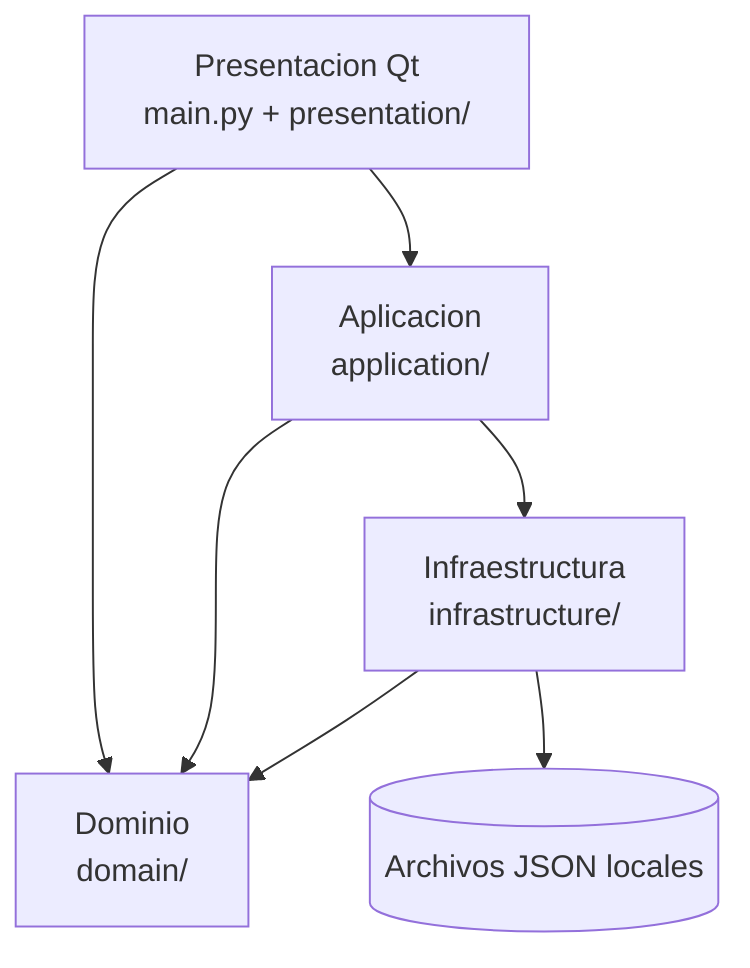

# Arquitectura de Study Timetrial

**Fecha de revisión:** 2026-09-07  
**Estado:** vigente para la implementación actual

Este documento describe la estructura que debe preservarse durante cambios
incrementales. Si una modificación cambia una responsabilidad o un contrato,
debe actualizarse este documento y la prueba correspondiente.

## Objetivo

Mantener una aplicación de escritorio pequeña, comprobable y sin dependencia de
PySide6 en la lógica que puede probarse sin una ventana. La interfaz traduce
eventos y estado visual; la aplicación coordina casos de uso; el dominio define
reglas y datos; la infraestructura gestiona archivos.

## Capas y dependencias



- **Presentación:** `presentation/main_window.py` compone la ventana; `presentation/presentation_dialogs.py` contiene diálogos Qt y construye modelos para los formularios; `presentation/presentation_formatters.py` adapta tiempos a texto y markup. `main.py` solo inicia Qt.
- **Aplicación:** `application/application_service.py` coordina sesiones, navegación, edición, importación y persistencia mediante `StudyApplicationService`.
- **Dominio:** `domain/models.py` define `TimerItem` y `Record`; `domain/timer_service.py` mantiene los estados y mediciones del cronómetro.
- **Infraestructura:** `infrastructure/storage_service.py` encapsula lectura, escritura y archivos recientes.
- **Pruebas:** `tests/` prueba aplicación, persistencia y adaptadores sin iniciar la interfaz Qt.

## Reglas de diseño

1. La presentación puede importar aplicación y tipos de dominio para adaptar formularios, pero no escribe JSON ni administra la persistencia por su cuenta.
2. `application/application_service.py` no importa PySide6. Las reglas de sesión y navegación viven allí o en servicios de dominio.
3. `domain/` no conoce Qt, widgets, rutas de interfaz ni servicios de almacenamiento.
4. `infrastructure/storage_service.py` es el único módulo que serializa registros y administra archivos recientes.
5. Las entidades mantienen los nombres de campos porque forman parte del contrato JSON existente.
6. Los nombres nuevos usan `snake_case`, clases `PascalCase` y constantes `UPPER_SNAKE_CASE`.
7. Las dependencias de `StudyApplicationService` se inyectan para usar dobles en memoria en las pruebas.
8. Los cambios de formato JSON requieren versionado o compatibilidad hacia atrás y una prueba.
9. Los widgets muestran estado y emiten acciones; no duplican reglas de negocio.
10. Cada módulo debe tener una breve docstring de responsabilidad y cada función pública debe explicar su contrato cuando no sea obvio.

## Contratos importantes

- El JSON conserva `schema_version: 1` y los campos de `Record` y `TimerItem`; el detalle está en [CONTRATO_JSON.md](CONTRATO_JSON.md).
- Los tiempos se almacenan en milisegundos enteros.
- `TimerMode` usa exactamente `WAITING`, `PLAY` y `BREAK`.
- `StudyApplicationService` es la fachada que usa la interfaz y recibe almacenamiento y cronometro por inyeccion.

## Validacion

La comprobación mínima después de una refactorización es:

```powershell
python -m unittest discover -s tests -v
python -m py_compile main.py presentation/main_window.py presentation/presentation_dialogs.py presentation/presentation_formatters.py application/application_service.py domain/models.py domain/timer_service.py infrastructure/storage_service.py
```

No se debe editar manualmente ningún JSON de usuario para resolver un problema
de código. Los cambios de interfaz se validan además iniciando `main.py` en un
entorno con PySide6. Los pasos completos están en [OPERACION_Y_VALIDACION.md](OPERACION_Y_VALIDACION.md).
