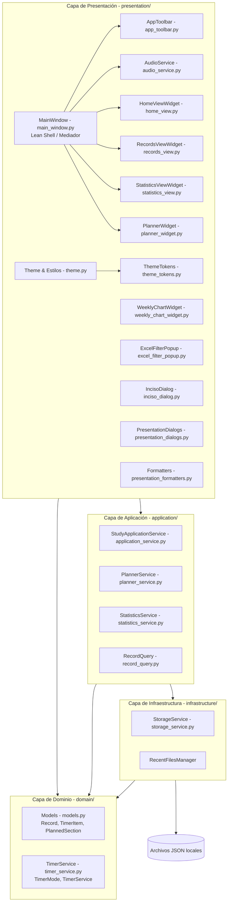

# Arquitectura de Study Timetrial

**Fecha de revisión:** 2026-09-11  
**Estado:** vigente para la implementación actual

Este documento describe la estructura que debe preservarse durante cambios
incrementales. Si una modificación cambia una responsabilidad o un contrato,
debe actualizarse este documento y la prueba correspondiente.

## Objetivo

Mantener una aplicación de escritorio modular, comprobable y sin dependencia de
PySide6 en la lógica que puede probarse sin una ventana. La interfaz traduce
eventos y gestiona el estado visual; la aplicación coordina casos de uso, consultas
y planificaciones; el dominio define reglas, modelos y entidades; la infraestructura
gestiona la persistencia en archivos JSON locales.

## Capas y dependencias



### Detalle de módulos por capa

- **Presentación (`presentation/`):**
  - `main_window.py`: Ventana principal (Lean Shell / Mediador). Coordina la integración del contenedor de pestañas (`QTabWidget`), la barra superior, la propagación de eventos entre vistas y el ciclo de vida del archivo con compatibilidad total hacia atrás.
  - `app_toolbar.py`: Barra de herramientas superior (`AppToolbar`) con menús desplegables de Archivo (Nuevo, Abrir, Recientes, Guardar como, Cerrar) y Configuración (Temas y conmutación de sonido).
  - `audio_service.py`: Servicio desacoplado (`AudioService`) que encapsula la carga y reproducción de sonidos `QSoundEffect`, persistencia en `QSettings` y estado de silenciamiento.
  - `home_view.py`: Vista modular del cronómetro (`HomeViewWidget`). Contiene relojes digitales, tarjeta de hoy, badges de ubicación, steppers táctiles numéricos y cuadrícula responsiva de botones de sesión.
  - `records_view.py`: Vista modular de registros (`RecordsViewWidget`). Encapsula la tabla interactiva de 12 columnas, KPIs superiores, búsqueda, popups estilo Excel y acciones sobre items.
  - `statistics_view.py`: Vista modular de estadísticas (`StatisticsViewWidget`). Presenta métricas agregadas globales, barras de proporción de estudio/receso, desglose por secciones e integra el gráfico semanal.
  - `weekly_chart_widget.py`: Renderiza el gráfico semanal con `QPainter` en alta resolución antialiasing, adaptado a modo claro y oscuro.
  - `planner_widget.py`: Visualiza la cuadrícula de planificación con tarjetas (`PlannedSectionCard`), grupos de ejercicios e incisos, barra de progreso y diálogo de carga de ejercicio.
  - `planner_dialogs.py`: Diálogos modales para alta, edición y configuración de secciones planificadas.
  - `excel_filter_popup.py`: Popup interactivo estilo Excel para filtrado por valores únicos y ordenamiento jerárquico por columna.
  - `inciso_dialog.py`: Diálogo modal para detección y resolución guiada de desfasajes de incisos (gap resolution).
  - `flow_layout.py`: Distribución adaptativa de elementos que ajusta filas y columnas automáticamente al redimensionar.
  - `presentation_dialogs.py`: Diálogos Qt para alta/edición manual de registros e importación selectiva desde otros archivos JSON.
  - `presentation_formatters.py`: Adaptadores para representar tiempos (`format_milliseconds`, `format_hh_mm`, `format_hh_mm_ss`, `timer_markup`).
  - `theme_tokens.py`: Definición tipada de tokens de diseño semánticos (`ThemeTokens`) para Modo Claro y Modo Oscuro, centralizando la paleta de colores.
  - `theme.py`: Motor paramétrico de generación de hojas de estilo QSS a partir de tokens de diseño, eliminando la duplicación de código CSS y facilitando temas adicionales.
  - `media/`: Recursos multimedia: efectos de audio (`.wav`) e iconos oficiales de la aplicación (`app_icon.ico`, `app_icon.png`, `stopwatch_vector.svg`).
  - `main.py`: Punto de entrada que configura `AppUserModelID` en Windows para la barra de tareas, inicializa `QApplication` con el icono oficial y levanta `MainWindow`.

- **Aplicación (`application/`):**
  - `application_service.py`: Fachada principal (`StudyApplicationService`) que expone casos de uso para sesión del cronómetro, navegación, comentarios pendientes, importación, límites de sesión y persistencia.
  - `planner_service.py`: Lógica de análisis de ejercicios planificados (`PlannerService`), cálculo de métricas de completitud ponderadas (`completed_weight`), sincronización de ejercicios no planificados y control de límites.
  - `statistics_service.py`: Cálculos estadísticos globales, distribución por días y por secciones (`DailyStatistic`, `SectionSummary`, `RecordStatistics`).
  - `record_query.py`: Filtrado multicriterio, ordenamiento jerárquico multicomponente y extracción de valores únicos para la vista Registros.

- **Dominio (`domain/`):**
  - `models.py`: Entidades del dominio: `TimerItem` (intento de ejercicio), `PlannedSection` (sección planificada con mapa de incisos) y `Record` (agrupador raíz persistido).
  - `timer_service.py`: Reloj monotónico de precisión milimétrica (`TimerService`) con estados `WAITING`, `PLAY` y `BREAK`, y soporte de pausa temporal sin pérdida de tiempo.

- **Infraestructura (`infrastructure/`):**
  - `storage_service.py`: Encapsula la lectura/escritura JSON atómica de `Record` (`StorageService`), resolución del directorio estándar (`default_directory`) y la gestión de la lista de archivos recientes (`RecentFilesManager`).

- **Capa de Datos y Persistencia (`data/`):**
  - `records/`: Almacén estructurado para archivos de registro de estudio (`StudyTimetrial_YYYYMMDD.json`), manteniendo la raíz del repositorio limpia.
  - `samples/`: Datasets y registros de prueba o demostración (`Algebra_Demo.json`).
  - `.study_timetrial_recent.json`: Índice de archivos de sesión abiertos recientemente.

- **Pruebas (`tests/`):**
  - 12 suites de pruebas unitarias (`test_application_service.py`, `test_planner_service.py`, `test_statistics_service.py`, `test_record_query.py`, `test_inciso_correction.py`, `test_main_window_records.py`, `test_main_window_planner.py`, `test_theme.py`, `test_app_icon.py`, etc.) que cubren la aplicación completa sin necesidad de abrir ventanas gráficas interactivas.

## Reglas de diseño

1. La presentación puede importar aplicación y tipos de dominio para adaptar formularios y vistas, pero nunca escribe JSON directamente ni gestiona la persistencia por su cuenta.
2. Ningún módulo de `application/`, `domain/` o `infrastructure/` importa PySide6 ni componentes gráficos de Qt.
3. `domain/` no conoce Qt, widgets, rutas de interfaz ni servicios de almacenamiento.
4. `infrastructure/storage_service.py` es el único módulo responsable de serializar registros y administrar archivos recientes.
5. Las entidades mantienen sus nombres de campos porque forman parte del contrato JSON público local existente.
6. Los nombres nuevos usan `snake_case`, clases `PascalCase` y constantes `UPPER_SNAKE_CASE`.
7. Las dependencias de `StudyApplicationService` se inyectan para permitir dobles en memoria en las pruebas.
8. Los cambios de formato JSON requieren versionado o compatibilidad hacia atrás estricta y su correspondiente prueba.
9. Los widgets muestran estado y emiten acciones; no duplican reglas de negocio ni cálculos matemáticos de métricas.
10. Cada módulo debe tener una breve docstring de responsabilidad y cada función pública debe explicar su contrato.

## Contratos importantes

- El JSON conserva `schema_version: 1`, los campos de `Record`, `TimerItem` y la lista de `planner_sections`; el detalle completo se encuentra en [CONTRATO_JSON.md](CONTRATO_JSON.md).
- Los tiempos se miden con reloj monotónico y se almacenan en milisegundos enteros no negativos.
- `TimerMode` opera estrictamente con `WAITING`, `PLAY` y `BREAK`.
- `StudyApplicationService` es la fachada que usa la interfaz y recibe almacenamiento y cronómetro por inyección de dependencias.

## Validación

La comprobación mínima tras una refactorización o cambio es:

```powershell
python -m unittest discover -s tests -v
python -m py_compile main.py presentation/main_window.py presentation/app_toolbar.py presentation/audio_service.py presentation/home_view.py presentation/records_view.py presentation/statistics_view.py presentation/weekly_chart_widget.py presentation/planner_widget.py presentation/planner_dialogs.py presentation/inciso_dialog.py presentation/excel_filter_popup.py presentation/flow_layout.py presentation/presentation_dialogs.py presentation/presentation_formatters.py presentation/theme_tokens.py presentation/theme.py application/application_service.py application/planner_service.py application/statistics_service.py application/record_query.py domain/models.py domain/timer_service.py infrastructure/storage_service.py
```

No se debe editar manualmente ningún JSON de usuario para resolver un problema de código. Los pasos completos están detallados en [OPERACION_Y_VALIDACION.md](OPERACION_Y_VALIDACION.md).
