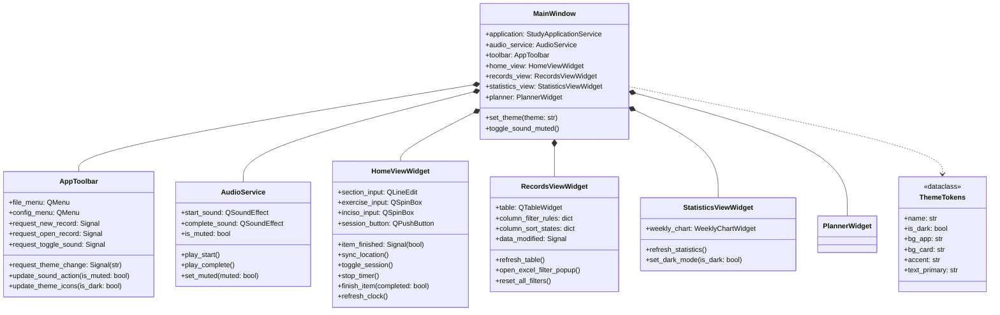

# Arquitectura de la Capa de Presentación

**Fecha de revisión:** 2026-09-13  
**Estado:** Vigente para la arquitectura modular de `presentation/`

Este documento describe en profundidad el diseño técnico, la descomposición de componentes, el flujo de señales y las directrices de extensibilidad de la interfaz de usuario en **Study Timetrial**.

---

## 1. Motivación y Principios de Diseño

Inicialmente, `main_window.py` acumulaba más de 2.100 líneas de código y `theme.py` superaba las 1.400 líneas con duplicación masiva de CSS. Para permitir que el proyecto sea escalable, legible y fácilmente extensible sin introducir regresiones, la capa de presentación se reestructuró bajo una **Arquitectura Basada en Componentes con Controlador Mediador (Component-Based Lean Shell)**.

### Principios clave aplicados:
* **Single Responsibility Principle (SRP):** Cada widget o servicio gestiona una única área funcional (el cronómetro, la tabla analítica, los gráficos, la barra de herramientas o el audio).
* **Open/Closed Principle (OCP):** Nuevos temas visuales o nuevas pestañas pueden añadirse creando nuevas clases sin necesidad de reescribir ni duplicar cientos de líneas de código.
* **Low Coupling / High Cohesion:** Las vistas se comunican mediante señales (`Signal`) de Qt y delegación limpia hacia `StudyApplicationService`.
* **Backward Compatibility (Compatibilidad hacia atrás):** `MainWindow` conserva métodos de fachada y propiedades delegadas (`@property`), garantizando que la suite de pruebas unitarias existente siga pasando al 100%.

---

## 2. Diagrama de Componentes de Presentación



---

## 3. Responsabilidad de los Módulos

### 3.1. `presentation/main_window.py` (Lean Shell)
* **Rol:** Orquestador central y contenedor de la ventana de la aplicación.
* **Responsabilidades:**
  1. Alojar el `QTabWidget` central y conectar la barra de herramientas `AppToolbar`.
  2. Inicializar las vistas especializadas (`HomeViewWidget`, `RecordsViewWidget`, `StatisticsViewWidget`, `PlannerWidget`).
  3. Despachar eventos entre vistas (por ejemplo, cuando un intento finaliza en `HomeView`, notifica a `RecordsView` y `PlannerWidget` para actualizarse).
  4. Gestionar el ciclo de vida del archivo (abrir, nuevo, guardar como, renombrar y cierre seguro con confirmación).
  5. Exponer propiedades y métodos fachada (`table`, `exercise_input`, `refresh_table`, etc.) para mantener la API pública estable.

### 3.2. `presentation/app_toolbar.py` (`AppToolbar`)
* **Rol:** Barra superior modular con navegación y acciones rápidas.
* **Responsabilidades:**
  1. Menú **Archivo**: Crear nuevo, abrir archivo JSON, submenú de archivos recientes, guardar como, cerrar archivo y salir.
  2. Menú **Configuración**: Selección exclusiva de temas visuales (Modo claro / Modo oscuro) y conmutación de silencio de sonidos.
  3. Emisión de señales desacopladas (`request_theme_change`, `request_open_record`, etc.).

### 3.3. `presentation/audio_service.py` (`AudioService`)
* **Rol:** Gestor de efectos sonoros y preferencias de audio.
* **Responsabilidades:**
  1. Carga y precalentamiento de los archivos `.wav` (`QSoundEffect`).
  2. Reproducción reactiva condicionada al estado de silencio (`play_start()`, `play_complete()`).
  3. Persistencia automática del estado de silencio en `QSettings("StudyTimetrial", "Preferences")`.

### 3.4. `presentation/home_view.py` (`HomeViewWidget`)
* **Rol:** Vista de ejecución y toma de tiempos.
* **Responsabilidades:**
  1. Renderizado del reloj digital de alta precisión para ejercicio y receso monotónico.
  2. Tarjeta con el tiempo total acumulado estudiado durante la jornada (`HOY`).
  3. Controles de ubicación: tipo de sección, número, ejercicio e inciso, acompañados de botones táctiles paso a paso (`steppers`).
  4. Disposición responsiva de los botones primarios (`INICIAR/RECESO/CONTINUAR`, `DETENER`, `COMPLETO`, `INCOMPLETO`, `COMENTARIO`) que se reorganizan automáticamente según el ancho de ventana (`_arrange_session_controls`).
  5. Flujo de resolución interactiva de desfasajes de incisos (`_prompt_inciso_gap_dialog`).

### 3.5. `presentation/records_view.py` (`RecordsViewWidget`)
* **Rol:** Vista analítica e interactiva de intentos históricos.
* **Responsabilidades:**
  1. Tabla de 12 columnas con cabeceras interactivas, indicador visual de ordenación (`▲`, `▼`) y filtro activo (`🔍`).
  2. Integración con `ExcelColumnFilterPopup` para filtrado por valores únicos y ordenamiento jerárquico.
  3. Tarjetas KPI superiores con resumen de intentos, tiempo de estudio, tiempo de receso y efectividad.
  4. Búsqueda instantánea en vivo por texto en todas las columnas relevantes.
  5. Acciones contextuales por fila: comentar intento, editar datos, reiniciar tiempo y eliminar registro con diálogo de confirmación.

### 3.6. `presentation/statistics_view.py` (`StatisticsViewWidget`)
* **Rol:** Vista de análisis de productividad y métricas acumuladas.
* **Responsabilidades:**
  1. Panel superior con el gráfico semanal interactivo antialiasing (`WeeklyChartWidget`).
  2. Tarjetas de métricas de alto nivel: tiempos totales, tiempos promedio, ejercicio más largo y porcentaje de ejercicios completados.
  3. Barra de distribución porcentual entre tiempo neto de estudio y tiempo de descanso.
  4. Tabla detallada con desglose por secciones académicas.

### 3.7. `presentation/theme_tokens.py` y `presentation/theme.py`
* **Rol:** Motor de diseño y estilos visuales parametrizados.
* **`theme_tokens.py`:** Define la dataclass `ThemeTokens` con tokens semánticos (fondos, superficies, bordes, tipografías, botones, badges, scrolls). Contiene las instancias oficiales `DARK_TOKENS` y `LIGHT_TOKENS`.
* **`theme.py`:** Generador paramétrico unificado (`build_stylesheet_from_tokens`). Renderiza la hoja de estilos QSS completa sustituyendo los valores de la paleta en una única plantilla paramétrica, reduciendo el código en más de 1.000 líneas y eliminando la duplicación estructural.

---

## 4. Guía de Extensibilidad para Desarrolladores

### 4.1. Cómo añadir un nuevo Tema Visual
Gracias a la abstracción con `ThemeTokens`, agregar un nuevo tema visual (por ejemplo, un tema *Nord* o *Solarized*) no requiere escribir ni una sola línea de CSS duplicado:

1. Abrir `presentation/theme_tokens.py`.
2. Crear una nueva instancia de `ThemeTokens`:
   ```python
   NORD_TOKENS = ThemeTokens(
       name="nord",
       is_dark=True,
       mode_comment="/* --- MODO NORD --- */",
       bg_app="#2e3440",
       bg_dialog="#3b4252",
       bg_surface="#3b4252",
       # ... asignar los tokens cromáticos correspondientes
   )
   ```
3. Registrarlo en el diccionario `THEME_TOKENS_MAP`:
   ```python
   THEME_TOKENS_MAP = {
       THEME_DARK: DARK_TOKENS,
       THEME_LIGHT: LIGHT_TOKENS,
       "nord": NORD_TOKENS,
   }
   ```
4. Añadir la opción en `AppToolbar`:
   ```python
   self.theme_nord_action = QAction("Modo Nord", self)
   self.theme_nord_action.triggered.connect(lambda: self.request_theme_change.emit("nord"))
   self.themes_menu.addAction(self.theme_nord_action)
   ```

### 4.2. Cómo añadir una nueva Pestaña o Vista
Para añadir una nueva vista (por ejemplo, "Metas" o "Calendario"):
1. Crear el widget modular en `presentation/` derivando de `QWidget` (ej. `presentation/goals_view.py`).
2. En `MainWindow.__init__`:
   ```python
   self.goals_view = GoalsViewWidget(self.application, parent=self)
   self.tabs.addTab(self.goals_view, qta.icon("fa5s.bullseye", color="#94a3b8"), "  Metas")
   ```
3. Conectar señales en `_connect_signals` si la nueva vista necesita reaccionar a cambios en los registros o el cronómetro.

---

## 5. Verificación y Validación

Cualquier cambio realizado sobre los módulos de presentación debe verificarse ejecutando:

```powershell
# 1. Validación sintáctica de todos los módulos
python -m py_compile presentation/main_window.py presentation/app_toolbar.py presentation/audio_service.py presentation/home_view.py presentation/records_view.py presentation/statistics_view.py presentation/theme_tokens.py presentation/theme.py

# 2. Ejecución de la suite completa de pruebas unitarias
python -m unittest discover -s tests -v
```
