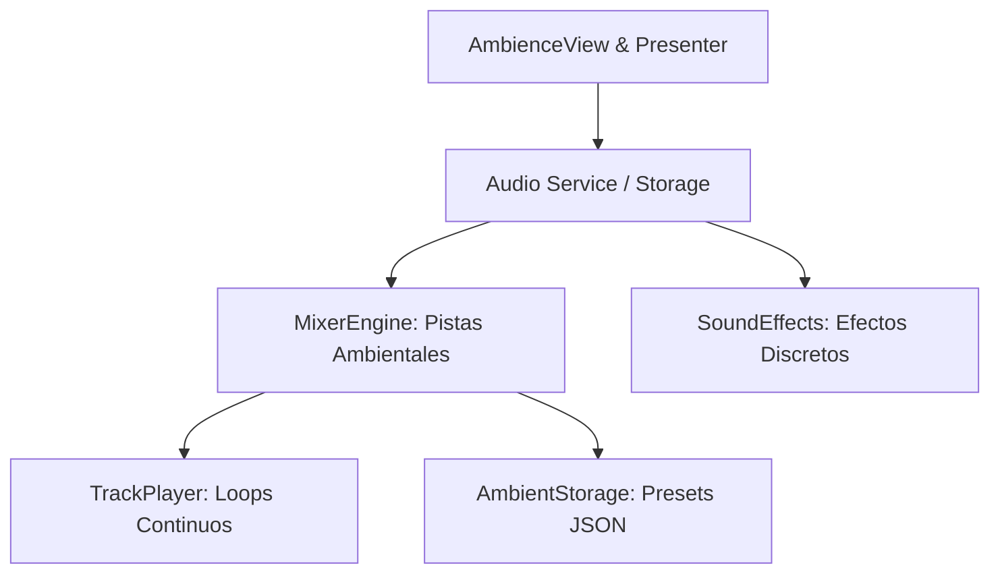

# Especificación Técnica: Subsistema de Audio y Mezclador Ambiental

**Identificador:** `AUDIO-SPEC-001`  
**Capa de Referencia:** `infrastructure/audio/` / `presentation/ambience/`  
**Estado:** Invariante / Producción  

---

## 1. Propósito
Gestionar la reproducción de pistas de sonido ambiental en bucle continuo (ruido blanco, rosa, lluvia, viento, etc.) con atenuación y transición suave de volumen (*fading*), así como la emisión de efectos sonoros discretos (inicio, fin, campana) vinculados al cronómetro.

---

## 2. Componentes del Subsistema

---

## 3. Requerimientos del Motor de Mezcla (`MixerEngine`)

1. **Pistas Múltiples Simultáneas:** Admite hasta `MAX_ACTIVE_TRACKS = 8` canales de reproducción independientes en bucle infinito (`Loops.Infinite`).
2. **Interpolación y Crossfading (30 FPS):**
   * Las variaciones de volumen entre modos (`PLAY`, `BREAK`, `WAITING`) se interpolan gradualmente a razón de 30 fotogramas por segundo (intervalo de ~33 ms) para evitar chasquidos acústicos (*pops/clicks*).
3. **Persistencia de Presets de Mezcla:**
   * Cada preset (`AmbiencePreset`) almacena volúmenes relativos para cada pista (`0.0` a `1.0`), estado de silenciamiento general y perfiles diferenciados según el modo del cronómetro.
4. **Resiliencia ante Fallos de Decodificación:**
   * Si un archivo de audio está dañado o no es compatible con el backend del sistema operativo, el canal emite un estado de error (`status = "error"`) y degrada elegantemente sin interrumpir las demás pistas ni detener la aplicación.

---

## 4. Efectos Sonoros Discretos (`SoundEffectsPlayer` / `AudioService`)

El subsistema gestiona efectos de sonido discretos reproducidos mediante `QSoundEffect`:

1. **Inicio de intento (`play_start`):** Emite `universfield-new-notification-040-493469.wav` al pasar a modo `PLAY`.
2. **Ejercicio completado (`play_complete`):** Emite `universfield-new-notification-051-494246.wav` cuando un intento finaliza exitosamente (`completed=True`).
3. **Ejercicio incompleto / fallo (`play_fail`):** Emite `fail.wav` cuando un intento finaliza sin completarse (`completed=False`).
4. **Silenciamiento:** Todas las emisiones son ignoradas si `is_muted` es verdadero, persistiendo el estado en `QSettings` (`Preferences/sound_muted`).
