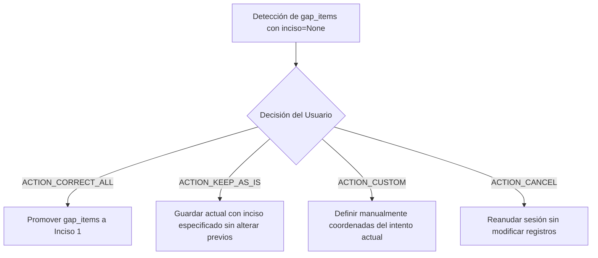

# Especificación Técnica: Resolución de Desfasaje de Incisos (Inciso Resolution)

**Identificador:** `CORE-SPEC-003`  
**Capa de Referencia:** `application/application_service.py` / `presentation/inciso_dialog.py`  
**Estado:** Invariante / Producción  

---

## 1. Problema y Contexto
Un usuario puede haber registrado inicialmente intentos para un ejercicio sin especificar incisos (almacenados con `inciso = None`). Más adelante, al estudiar el mismo ejercicio, decide registrar con un inciso explícito (por ejemplo, `inciso = 1` o `inciso = 2`).

Esto genera un desfasaje estructural: existen registros huérfanos sin inciso para el mismo ejercicio.

---

## 2. Detección de Desfasaje (`gap_items`)

Se detecta un conflicto de incisos cuando:
1. El usuario intenta finalizar o cambiar la ubicación hacia una coordenada `(section_type, section_number, exercise, inciso)` con `inciso is not None`.
2. En el archivo de registros activo (`record.items`), existen elementos previos que coinciden en `(section_type, section_number, exercise)` pero tienen `item.inciso is None`.

La lista de items en conflicto se denomina `gap_items: list[TimerItem]`.

---

## 3. Acciones de Resolución Disponibles

El usuario o cliente puede optar por tres resoluciones:

1. **`ACTION_CORRECT_ALL` (`"correct_all"`):**  
   * Los registros en `gap_items` se actualizan automáticamente asignándoles `item.inciso = 1`.  
   * El intento actual se guarda con el inciso correspondiente.  
   * Se ejecuta `application.promote_gap_items(gap_items, target_inciso=1)` y se persiste el archivo.
2. **`ACTION_KEEP_AS_IS` (`"keep_as_is"`):**  
   * Los registros previos permanecen intactos con `inciso = None`.  
   * El intento actual se guarda con su inciso asignado.
3. **`ACTION_CUSTOM` (`"custom"`):**  
   * El usuario ajusta interactivamente los valores de sección, ejercicio e inciso para este intento antes de guardar.
4. **`ACTION_CANCEL` (`"cancel"`):**  
   * Se descarta la acción de guardado, reanudando el cronómetro si estaba activo.
