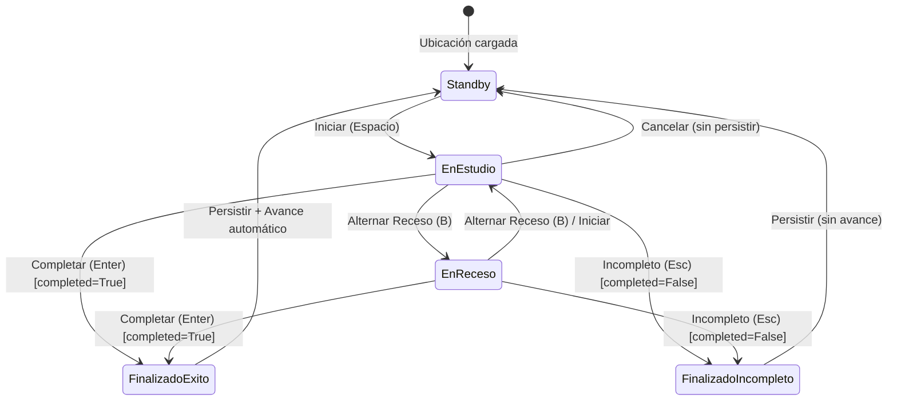

# Especificación Técnica: Ciclo de Vida de Sesión (Session Lifecycle)

**Identificador:** `CORE-SPEC-002`  
**Capa de Referencia:** `application/application_service.py`  
**Estado:** Invariante / Producción  

---

## 1. Propósito
Definir las transiciones de estado, atajos, mutación de coordenadas (`SessionLocation`), captura de comentarios/etiquetas y persistencia atómica de un intento de estudio.

---

## 2. Coordenadas de Sesión (`SessionLocation`)

Cada intento se registra bajo una tupla identificatoria de ubicación:
* `section_type`: Cadena descriptiva (por defecto `"Guía"`).
* `section_number`: Entero positivo ($\ge 1$).
* `exercise`: Entero positivo ($\ge 1$).
* `inciso`: Entero positivo ($\ge 1$) o `None` (indicando ejercicio sin incisos).

---

## 3. Diagrama de Transición de Estados

---

## 4. Reglas de Transición y Persistencia

1. **Condición de Finalización:**
   * Solo es posible finalizar un intento si el cronómetro está activo (`mode != WAITING`) o si se encuentra en modo edición/continuación (`editing_item_id is not None`).
2. **Construcción del `TimerItem`:**
   * Al finalizar, se extrae el snapshot del cronómetro: `exercise_ms, break_ms = timer.snapshot()`.
   * Se crea una entidad `TimerItem` con:
     * `timestamp`: ISO-8601 de fecha/hora de creación.
     * `section_type`, `section_number`, `exercise`, `inciso` tomados de `SessionLocation`.
     * `exercise_time_ms`, `break_time_ms`.
     * `completed`: booleano (`True` si fue completado, `False` si fue incompleto).
     * `comment`: texto acumulado en `pending_comment`.
3. **Modo Edición / Sobrescritura (`is_editing`):**
   * Si `editing_item_id` está activo y `overwrite=True`, se actualizan los campos del registro existente en `record.items`.
   * Si `overwrite=False`, se anexa como un nuevo registro independiente.
4. **Post-Finalización:**
   * Se persiste el archivo atómicamente (`save()`).
   * Se reinicia el cronómetro (`timer.reset()`).
   * Se limpia `pending_comment = ""`, `editing_item_id = None`.
   * **Avance Automático:** Si `completed=True`, se avanza el inciso o ejercicio de acuerdo a la configuración activa de la sección. Si `completed=False`, la ubicación permanece inalterada para permitir un nuevo intento.
