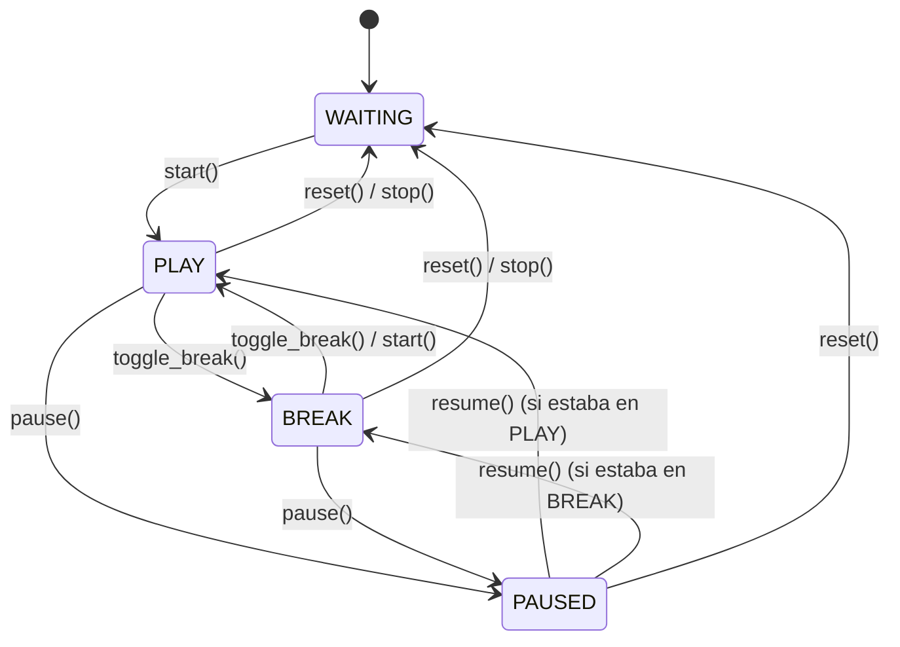

# Especificación Técnica: Motor de Cronómetro (Timer Engine)

**Identificador:** `CORE-SPEC-001`  
**Capa de Referencia:** `domain/timer_service.py`  
**Estado:** Invariante / Producción  

---

## 1. Propósito
Centralizar la medición y acumulación monotónica precisa del tiempo dedicado a un ejercicio de estudio y a sus descansos asociados, evitando desvíos por latencia de renderizado o variaciones del reloj del sistema.

---

## 2. Máquina de Estados del Cronómetro



### Estados:
* **`WAITING` (`"waiting"`):** Reloj detenido. El contador no avanza. Puede tener tiempos acumulados previamente cargados.
* **`PLAY` (`"play"`):** Sesión de estudio activa. Acumula milisegundos en `exercise_time_ms`.
* **`BREAK` (`"break"`):** Período de descanso/receso. Acumula milisegundos en `break_time_ms`.
* **`PAUSED` (flag `is_paused = True`):** Congelamiento temporal sin perder el modo (`PLAY` o `BREAK`). No acumula delta de tiempo mientras esté en pausa.

---

## 3. Algoritmo de Medición Monotónica

1. **Fuente de tiempo:** Utiliza exclusivamente reloj monotónico de alta resolución (`time.perf_counter()` en Python, `performance.now()` en JavaScript/Web, `std::time::Instant` en Rust).
2. **Sincronización diferencial (`_sync`):**
   ```text
   now = current_monotonic_time()
   delta = round((now - last_tick) * 1000)
   last_tick = now

   if mode == PLAY and not is_paused:
       exercise_time_ms += delta
   elif mode == BREAK and not is_paused:
       break_time_ms += delta
   ```
3. **Invariantes:**
   * `exercise_time_ms >= 0` y `break_time_ms >= 0`.
   * El paso a pausa ejecuta un `_sync()` inmediato antes de fijar `is_paused = True`.
   * La reanudación (`resume()`) actualiza `last_tick = now` **sin** sumar el tiempo que transcurrió durante la pausa.

---

## 4. API de Contrato

| Método | Argumentos | Retorno | Descripción |
| :--- | :--- | :--- | :--- |
| `start()` | ninguno | `void` | Pasa al modo `PLAY` y comienza la acumulación de estudio. |
| `toggle_break()` | ninguno | `void` | Alterna entre `PLAY` y `BREAK` conservando la acumulación. |
| `pause()` | ninguno | `void` | Sincroniza y congela la acumulación. |
| `resume()` | ninguno | `void` | Reanuda el reloj sin acumular el intervalo de congelamiento. |
| `reset()` | ninguno | `void` | Reinicia ambos acumuladores a 0 y modo a `WAITING`. |
| `snapshot()` | ninguno | `tuple[int, int]` | Ejecuta sincronización forzada y retorna `(exercise_ms, break_ms)`. |
| `load_accumulated_times()` | `(exercise_ms: int, break_ms: int)` | `void` | Fija tiempos base iniciales dejando el reloj en `WAITING`. |
