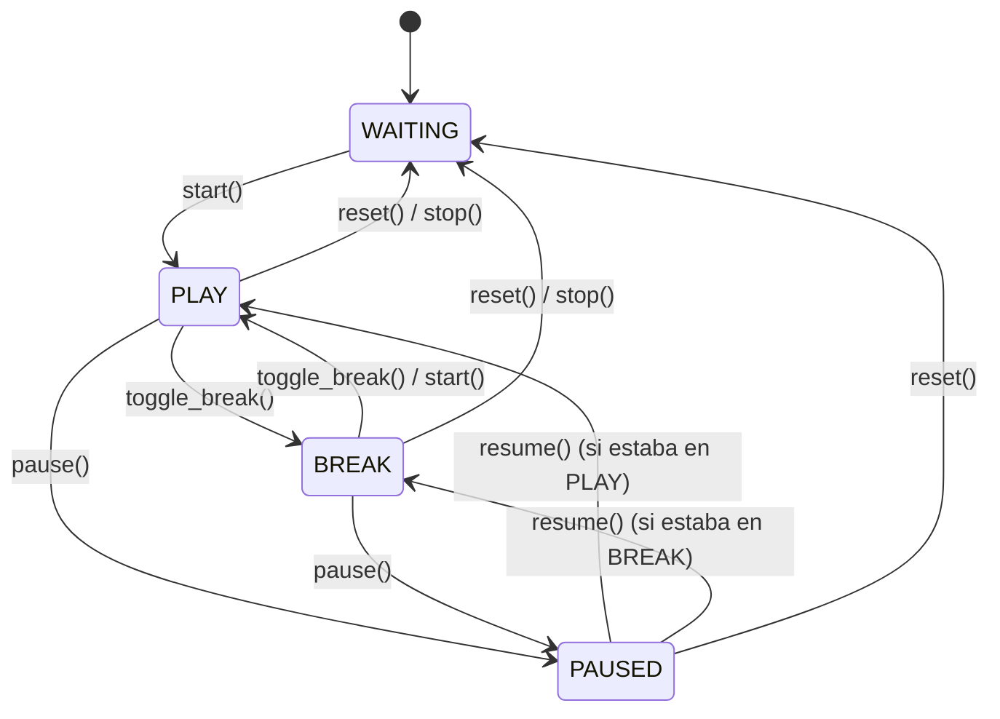

# Especificación Técnica: Motor de Cronómetro (Timer Engine)

**Identificador:** `CORE-SPEC-001`  
**Capa de Referencia:** `domain/timer_service.py`  
**Estado:** Invariante / Producción  

---

## 1. Propósito
Centralizar la medición y acumulación monotónica precisa del tiempo dedicado a un ejercicio de estudio y a sus descansos asociados, evitando desvíos por latencia de renderizado o variaciones del reloj del sistema.

---

## 2. Máquina de Estados del Cronómetro


```mermaid
stateDiagram-v2
    [*] --> WAITING
    WAITING --> PLAY : start()
    PLAY --> BREAK : toggle_break()
    BREAK --> PLAY : toggle_break() / start()
    PLAY --> PAUSED : pause()
    BREAK --> PAUSED : pause()
    PAUSED --> PLAY : resume() (si estaba en PLAY)
    PAUSED --> BREAK : resume() (si estaba en BREAK)
    PLAY --> WAITING : reset() / stop()
    BREAK --> WAITING : reset() / stop()
    PAUSED --> WAITING : reset()
```

### Estados:
* **`WAITING` (`"waiting"`):** Reloj detenido. El contador no avanza. Puede tener tiempos acumulados previamente cargados.
* **`PLAY` (`"play"`):** Sesión de estudio activa. Acumula milisegundos en `exercise_time_ms`.
* **`BREAK` (`"break"`):** Período de descanso/receso. Acumula milisegundos en `break_time_ms`.
* **`PAUSED` (flag `is_paused = True`):** Congelamiento temporal sin perder el modo (`PLAY` o `BREAK`). No acumula delta de tiempo mientras esté en pausa.

---

## 3. Algoritmo de Medición Monotónica Anclada (Zero-Drift)

1. **Fuente de tiempo:** Utiliza exclusivamente reloj monotónico de alta resolución (`time.perf_counter()` en Python).
2. **Sincronización diferencial con arrastre fraccional (`_sync`):**
   Para prevenir la acumulación de errores de redondeo (que provocaban fugas de varios segundos en sesiones extensas), el temporizador emplea un ancla flotante continua:
   ```text
   now = current_monotonic_time()
   elapsed_s = max(0.0, now - _segment_start)
   consumed_ms = int(elapsed_s * 1000)

   if consumed_ms > 0:
       _segment_start += (consumed_ms / 1000.0)  # Preserva remanente sub-milisegundo exacto
       if mode == PLAY and not is_paused:
           exercise_time_ms += consumed_ms
       elif mode == BREAK and not is_paused:
           break_time_ms += consumed_ms
   ```
3. **Invariantes:**
   * `exercise_time_ms >= 0` y `break_time_ms >= 0`.
   * El paso a pausa ejecuta un `_sync()` inmediato y desancla `_segment_start = None`.
   * La reanudación (`resume()`) fija `_segment_start = time.perf_counter()` **sin** sumar el tiempo que transcurrió durante la pausa.
   * Deriva de reloj acumulada: matemáticamente **0.000 ms** independientemente de la frecuencia de refresco de la UI o de la duración de la sesión.
   * **Visualización de Contadores:** La capa de presentación (`timer_markup`) expone el tiempo en formato de 3 bloques consistentes con unidades tipográficas inline suaves (`00h 25m 14s`). Las letras `h`, `m`, `s` se renderizan al 52% del tamaño principal con opacidad atenuada (65%) y `setWordWrap(False)`, eliminando cualquier ambigüedad entre horas y minutos y previniendo saltos de ancho (layout shifts). Se eliminan los milisegundos fraccionales `.sss` de la vista para preservar la concentración y optimizar la tasa de refresco a 100 ms.

---

## 4. API de Contrato

| Método | Argumentos | Retorno | Descripción |
| :--- | :--- | :--- | :--- |
| `start()` | ninguno | `void` | Pasa al modo `PLAY` y comienza la acumulación de estudio. |
| `toggle_break()` | ninguno | `void` | Alterna entre `PLAY` y `BREAK` conservando la acumulación. |
| `pause()` | ninguno | `void` | Sincroniza y congela la acumulación. |
| `resume()` | ninguno | `void` | Reanuda el reloj sin acumular el intervalo de congelamiento. |
| `reset()` | ninguno | `void` | Reinicia ambos acumuladores a 0 y modo a `WAITING`. |
| `snapshot()` | ninguno | `tuple[int, int]` | Ejecuta sincronización forzada y retorna `(exercise_ms, break_ms)`. |
| `load_accumulated_times()` | `(exercise_ms: int, break_ms: int)` | `void` | Fija tiempos base iniciales dejando el reloj en `WAITING`. |
