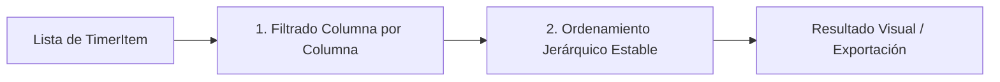

# Especificación Técnica: Consulta, Ordenamiento y Filtrado de Registros

**Identificador:** `DATA-SPEC-002`  
**Capa de Referencia:** `application/record_query.py`  
**Estado:** Invariante / Producción  

---

## 1. Propósito
Proveer capacidades de consulta en memoria sobre el conjunto de intentos de estudio (`TimerItem`), emulando el comportamiento de tablas de datos analíticas estilo Excel: ordenamiento multi-columna jerárquico y filtrado por valores únicos o rangos.

---

## 2. Definición de Columnas de Datos

| Clave Interna | Etiqueta Visible | Tipo de Dato | Criterio de Ordenamiento |
| :--- | :--- | :--- | :--- |
| `section` | Sección | Texto | Tipo de sección alfabético + Número ascendente |
| `exercise` | Ejercicio | Entero | Numérico |
| `inciso` | Inciso | Entero / None | Numérico (`None` agrupa como Sin inciso) |
| `created_at` | Fecha | Datetime | Cronológico (ISO-8601) |
| `break_time_ms` | Receso | Entero (ms) | Numérico |
| `exercise_time_ms` | Tiempo | Entero (ms) | Numérico |
| `completed` | Estado | Booleano | `"Completo"` vs `"Incompleto"` |
| `comment` | Comentario | Texto | Alfabético / Búsqueda por subcadena |

---

## 3. Modelo de Filtro (`ExcelFilterState`)

Cada columna puede poseer un estado de filtrado compuesto por:
1. `selected_values: set[str] | None`: Si es un conjunto, solo se admiten los registros cuyo valor formateado pertenezca al conjunto. Si es `None`, no hay filtro activo en la columna.
2. `search_term: str`: Subcadena para filtrado interactivo instantáneo.
3. `date_filter`: Filtros predeterminados de fecha (`"today"`, `"yesterday"`, `"this_week"`, `"this_month"` o rango personalizado).

---

## 4. Pipeline de Procesamiento

1. **Filtrado:** Se evalúa secuencialmente cada `TimerItem` contra los filtros de todas las columnas activas. El item se descarta si no cumple con al menos una de las condiciones.
2. **Ordenamiento Jerárquico Estable:**  
   Se aplica una lista de directivas `(column_key, ascending: bool)` evaluadas de derecha a izquierda (algoritmo estándar de ordenación estable de Python/Timsort), asegurando que la primera columna en la lista de jerarquía sea la dominante.
